# CMU-15445 2024Fall

## 环境搭建和项目准备

### 1.软件和环境配置

项目的编译测试等都需要运行在linux下面，因此在windows上采取的方案为**Windows 上的安装VS Code** ，**远程remote wsl连接Ubuntu22.04的文件系统**，**实际编译和执行都在 WSL 的Ubuntu22.04环境中进行**，苹果Macos也类似

**（1）所需要的软件：**

**git + VSCode + LLVM全家桶 + cmake**

其中LLVM和cmake是安装在Unbuntu上的：

`clang`：**更人性化的编译器**

`clangd`：**类似于IntelliSense 但更智能**

`lldb`：**调试工具（LLVM 生态的 GDB 替代品）**

`cmake`：**构建项目（同时生成 compile_commands.json 的关键clangd`需要）**

```shell
sudo apt install clang clangd lldb cmake
```

**（2）安装VSCode上的插件 需要安装的有：**

**cmake和camketools、clanged、CodeLLDB依次安装即可**，这部分插件是需要通过**远程连接到Ubuntu22.04**后在上面进行远程安装的

**（3）安装LLVM 17回到ubuntu里面，我们需要运行如下命令：**

```shell
wget https://mirrors.tuna.tsinghua.edu.cn/llvm-apt/llvm.sh
chmod +x llvm.sh
sudo ./llvm.sh all -m https://mirrors.tuna.tsinghua.edu.cn/llvm-apt
```

**（4）克隆busthub项目到本地PC**

先进行克隆仓库操作，克隆项目就是 **获取官方课程代码模板**，然后在此基础上实现你的部分代码。没有这个仓库，就无法完成 15-445 的 Lab 和 Project，因为测试用例、框架、CMake 配置、工具链全都在里面，主要步骤如下：

① 在自己的github上创建一个bustub-private的仓库

② 在本地添把公共库的历史记录裸克隆到本地 这个克隆只包含提交历史记录 没有任何工作文件

```shell
git clone --bare https://github.com/cmu-db/bustub.git bustub-public
```

③ 把刚刚克隆的公共库推送到远程bustub-privete 前三步主要是为了避免从本地克隆整个公共库又把整个库推送到远程 会比较浪费时间 只需要从公共库推送到私人库即可

```shell
cd bustub-public
# If you pull / push over HTTPS
git push https://github.com/student/bustub-private.git master
# If you pull / push over SSH
git push git@github.com:student/bustub-private.git master
# 如果选用ssh方式需要按照流程配置密匙
```

④ 删除本地的公共克隆 并把远程的私有库克隆到本地

```shell
cd ..
rm -rf bustub-public
mkdir cmu-15445 && cd cmu-15445
# If you pull / push over HTTPS
git clone https://github.com/MingrHu/bustub-private.git
# If you pull / push over SSH
git clone git@github.com:MingrHu/bustub-private.git
```

⑤ 如果是做的之前的项目 例如2024Fall则需要从历史记录里面拉取之前的2024Fall版本的仓库快照，可从公共库里面的提交标签去拉取2024Fall版本的仓库


拉取标签处的提交，直接更新为当前2024Fall的版本，提交后同步到私人库

```shell
# 覆盖工作目录中的文件，不移动 HEAD 指针
git checkout 570547381a71e6494cc02ee457f3163bdf004eb6 -- .
```

否则如果是最新的项目，无需上面的步骤

⑥ 将公共的 BusTub 仓库添加为第二个远程仓库

```shell
git remote add public https://github.com/cmu-db/bustub.git
```

查看是否添加成功

```shell
# 输出
# colin@RogDemon-7P:~/cmu-15445/bustub-private$ 
git remote -v
origin  git@github.com:MingrHu/bustub-private.git (fetch)
origin  git@github.com:MingrHu/bustub-private.git (push)
public  https://github.com/cmu-db/bustub.git (fetch)
public  https://github.com/cmu-db/bustub.git (push)
```

上述的具体流程参考[https://github.com/cmu-db/bustub](https://github.com/cmu-db/bustub?tab=readme-ov-file)里面的READEME，目前基本前置环境配置完成，需要注意的是，在wsl上采用http克隆可能会有网络问题，因此简要介绍ssh克隆的流程

```shell
# 创建ssh密匙
ssh-keygen -t ed25519 -C "your_email@example.com"
# 查看密匙
ls -al ~/.ssh
# 启动代理并且添加私匙 
colin@RogDemon-7P:~$ eval "$(ssh-agent -s)"
Agent pid 8472
colin@RogDemon-7P:~$ ssh-add ~/.ssh/id_ed25519
Identity added: /home/colin/.ssh/id_ed25519 (1696994159@qq.com)
# 获取公匙内容 从而添加到github的sshkey里面
cat ~/.ssh/id_ed25519.pub
# 检测是否能和远程GitHub仓库建立ssh连接 
colin@RogDemon-7P:~$ ssh -T git@github.com
The authenticity of host 'github.com (20.205.243.166)' can't be established.
ED25519 key fingerprint is SHA256:+DiY3wvvV6TuJJhbpZisF/zLDA0zPMSvHdkr4UvCOqU.
This key is not known by any other names
Are you sure you want to continue connecting (yes/no/[fingerprint])? yes
Warning: Permanently added 'github.com' (ED25519) to the list of known hosts.
Hi MingrHu! You've successfully authenticated, but GitHub does not provide shell access.
```

然后执行ssh克隆

```shell
git clone --bare git@github.com:cmu-db/bustub.git bustub-public
```

在自己的GitHub上创建私人仓库 并将当前目录下的公共框架仓库推送过去

```shell
git push git@github.com:MingrHu/bustub-private.git master
```

**剩下的部分参考bustub和前面的内容**

### 2.编译项目

这部分内容也请参考https://github.com/cmu-db/bustub?tab=readme-ov-file

```shell
# Linux
sudo build_support/packages.sh
# macOS
build_support/packages.sh
```

编译构建

```shell
mkdir build
cd build
cmake ..
make
# 如果macos出现如下报错
CMake Error at third_party/murmur3/CMakeLists.txt:1 (cmake_minimum_required):
Compatibility with CMake < 3.5 has been removed from CMake.

Update the VERSION argument <min> value.  Or, use the <min>...<max> syntax
to tell CMake that the project requires at least <min> but has been updated
to work with policies introduced by <max> or earlier.

Or, add -DCMAKE_POLICY_VERSION_MINIMUM=3.5 to try configuring anyway.
# 如下
cmake -DCMAKE_POLICY_VERSION_MINIMUM=3.5 ..
```

如果在构建项目的时候提示没有用clang：

```shell
sudo update-alternatives --install /usr/bin/clang clang /usr/bin/clang-14 100
sudo update-alternatives --install /usr/bin/clang++ clang++ /usr/bin/clang++-14 100
# 重新build
cd ~/cmu-15445/bustub-private
rm -rf build    # 删除旧的 build 目录
mkdir build     # 新建 build 目录
cd build
# cmake主要是根据项目的makefilelists构建makefile
[CMakeLists.txt] --(cmake)--> [Makefile] --(make)--> [binary output]
mkdir build
cd build
cmake ..       # 生成 Makefile
make           # 编译程序
# 如果macos提醒cmake版本问题直接强制降级忽略即可
cmake .. -DCMAKE_POLICY_VERSION_MINIMUM=3.5
```

如果需要切换编译选项为Debug模式，直接传入cmakelists就行

```shell
cmake -DCMAKE_BUILD_TYPE=Debug ..
make -j`nproc`
```

整个项目结构：

```
drwxr-xr-x 11 colin colin  4096 Jul 22 22:39 ./
drwxr-xr-x  3 colin colin  4096 Jul 22 21:27 ../
-rw-r--r--  1 colin colin   241 Jul 22 21:37 .clang-format
-rw-r--r--  1 colin colin  5128 Jul 22 21:37 .clang-tidy
-rw-r--r--  1 colin colin    44 Jul 22 21:37 .dockerignore
drwxr-xr-x  8 colin colin  4096 Jul 22 21:37 .git/
-rw-r--r--  1 colin colin    18 Jul 22 21:37 .gitattributes
drwxr-xr-x  3 colin colin  4096 Jul 22 21:37 .github/
-rw-r--r--  1 colin colin  4360 Jul 22 21:37 .gitignore
-rw-r--r--  1 colin colin 16813 Jul 22 22:32 CMakeLists.txt
-rw-r--r--  1 colin colin  1185 Jul 22 21:37 GRADESCOPE.md.template
-rw-r--r--  1 colin colin  1075 Jul 22 21:37 LICENSE
-rw-r--r--  1 colin colin  5959 Jul 22 21:37 README.md
drwxr-xr-x  9 colin colin  4096 Jul 22 22:52 build/
drwxr-xr-x  3 colin colin  4096 Jul 22 21:37 build_support/
-rwxr-xr-x  1 colin colin  3546 Jul 22 21:37 gradescope_sign.py*
drwxr-xr-x  2 colin colin  4096 Jul 22 21:37 logo/
drwxr-xr-x 16 colin colin  4096 Jul 22 21:37 src/
drwxr-xr-x 16 colin colin  4096 Jul 22 21:37 test/
drwxr-xr-x 13 colin colin  4096 Jul 22 21:37 third_party/
drwxr-xr-x 12 colin colin  4096 Jul 22 21:37 tools/
```

**其中build项目里面执行make操作，CMakeLists.txt已经默认写好，我们需要完成的就是src里面的的代码，并执行test进行测试**

## Project #0 - C++ Primer

### 背景介绍

第一个项目没什么好说的 比较简单 本质上需要去理解HLL这个数据结构大致结构 具体情况如下：

考虑跟踪单日访问网站的唯一用户数量这一问题。对于仅由少数人访问的小型网站，这一任务非常直接；但对于拥有数十亿用户的大型网站，处理起来则困难得多。在这种情况下，将每个用户存储在列表中并检查重复项是不现实的。海量数据会导致一系列重大挑战，包括内存耗尽、处理速度缓慢以及其他效率问题。

`HyperLogLog（HLL）`是一种用于跟踪大型数据集基数的**概率数据结构**。HLL 适用于上述场景，其目标是*在不显式存储每个元素的情况下，统计大规模数据流中的唯一元素数量*。HLL 依赖巧妙的哈希机制和紧凑的数据结构，只需传统方法所需内存的一小部分，即可提供对唯一用户数的准确估计。这使其成为现代数据库分析中的重要工具。

**简单来说就是面多大规模用户数据，如何去重并统计总数（常规方法用位图解决，布隆过滤器对于某些情况也适用）**

`HLL` 的核心是通过**哈希函数**将元素映射到二进制位序列，利用 **“前导零计数”** 来概率性地估计基数，避免显式存储所有元素。HLL 的概率计数机制基于以下参数：

- `b`：哈希值的二进制表示形式中的初始位数，用于划分桶（Bucket）的初始位数，决定桶的数量 `m = 2^b`。
- `m`：桶的数量（也称为寄存器 `Registers`），每个桶存储一个非负整数。
- `p`：哈希值中左起第一个 `1` 的位置（即前导零的数量加 1）。

 以字符串 `"A great database is a great life" `为例，说明算法的工作原理：

1. 首先对字符串进行哈希处理，生成哈希值，并转换为二进制表示。假设为：`110 0000101011010`

   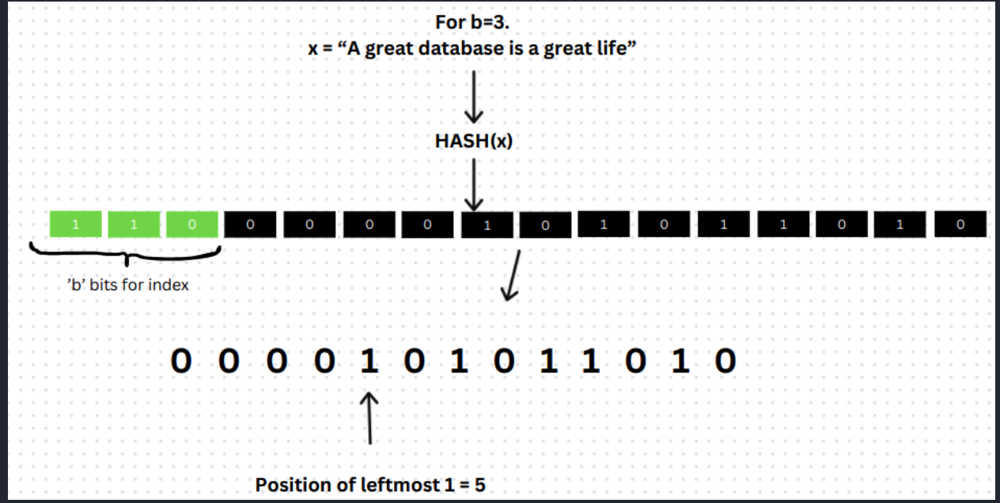

2. 从哈希值的二进制形式中，从最高有效位（MSB）开始提取 **b 位**（`101`），根据这 b 位计算对应的寄存器索引（例如，若 b=3，则 2^3=8 个寄存器，索引范围为 0-7，且`110`转换为十进制是`6`，因此该元素属于**桶6**）。初始时，每个寄存器的值为 0（即 `register[0]~register[7]` 初始均为 **0**）。

3. 从剩余的二进制位中，找到最左侧 1 的位置 **p**（即前导零的数量加 1）。例如，若剩余位为 `000010...`，则前导零有 4 个，p=4+1=5。则该元素在桶6，且值为p=5。

   

4. 对于当前寄存器索引（由前 b 位确定），将其值更新为 **max (寄存器当前值，p)**。

   - 比较当前寄存器值 `0` 和新计算的 `p=4`，取最大值：`register[6] = max(0, 5) = 5`
   - 若后续有另一个元素也属于桶 6，且计算得到 `p=3`，则：`register[6] = max(5, 3) = 5`
   - 若新元素的 `p=6`，则：`register[6] = max(5, 6) = 6`

按上述步骤添加集合中的所有元素之后，按以下方式计算基数（唯一元素数）：

- 若共有 **m 个寄存器**，则基数估计公式为：

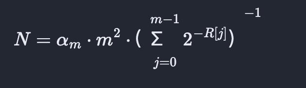

其中，`α_m` 是修正常数（当 `m` 较大时，通常取 0.79402），`R[j]` 是第 j 个寄存器（桶）的值。

本质上：

1.根据输入的b值确定桶的数量 

2.然后哈希一个字符串或者需要存储的值 哈希完成后转为二进制值 全64位

3.取前b位 并计算在哪个桶

4.计算剩下的64 - b位中最高置位的pos 这个位越高 前导0的数量就越少 说明在这个桶下元素一致的可能性越低（ 类似于基数树 每层的前缀是一样的 那么元素数量就越少 前导0越少 说明在这个桶下面的元素分布范围可能很大）

5.根据公式和修正值遍历计算寄存器的值 从而输出预估非重复元素的数量

不同的桶所使用的数据大小

| 桶数 (m) | 内存占用 | 理论误差率 | 实际应用场景           |
| -------- | -------- | ---------- | ---------------------- |
| 16       | 16B      | ~26%       | 玩具示例               |
| 256      | 256B     | ~6.5%      | 小规模基数统计         |
| 16384    | 12KB     | ~0.81%     | 亿级数据（如 Redis）   |
| 131072   | 96KB     | ~0.28%     | 超大规模数据（如 GCP） |

- **Redis 的选择**：16384 个桶在内存（12KB）和精度（0.81%）之间取得平衡，适用于多数互联网场景（如 Reddit 的帖子浏览量统计）。
- **扩展性**：若需更高精度（如 0.28%），可增加桶数至 131072，但内存消耗增至 96KB。

**本质上任何大小的桶数都可以计算任意大小的数据 例如十亿的数也可以采用桶为16的HLL 只是误差特别大** 

- 无论输入数据是十亿还是万亿，HLL的桶数量和寄存器位数不变，空间始终固定。
- 极端情况下（如所有元素哈希到同一桶），HLL仍通过调和平均数修正误差，但空间不增加。

HLL的空间占用与数据规模无关，仅由以下固定参数决定：

1. 桶数量（m）：

   默认使用16384个桶（214），通过哈希值前14位索引。

   每个桶存储一个6位寄存器（记录前导零的最大值*z**i*），理论需16384×6位=12KB。

2. 存储格式优化：

   **密集格式（Dense）**：固定12KB，直接存储所有桶的6位值。

   **稀疏格式（Sparse）**：当数据密度低时，用游程编码压缩零值桶，但最终合并或达到阈值（如3000字节）后仍会转为密集格式。

### 1.TASK#1

无需过多介绍解释 主要注意一些边界和不合理的数据输入处理情况 根据要求实现即可 总体实现如下 

需要修改的文件：

```c++
namespace bustub {

/** @brief Parameterized constructor. */
template <typename KeyType>
HyperLogLog<KeyType>::HyperLogLog(int16_t n_bits) : cardinality_(0), b_(0), flag_(false) {
  if (n_bits < 0 || n_bits >= 64) {
    flag_ = true;
    return;
  }
  b_ = n_bits;
  regist_.resize((1 << n_bits), 0);
}

/**
 * @brief Function that computes binary.
 *
 * @param[in] hash
 * @returns binary of a given hash
 */
template <typename KeyType>
auto HyperLogLog<KeyType>::ComputeBinary(const hash_t &hash) const -> std::bitset<BITSET_CAPACITY> {
  /** @TODO(student) Implement this function! */
  std::bitset<BITSET_CAPACITY> res(hash);
  return res;
}

/**
 * @brief Function that computes leading zeros.
 *
 * @param[in] bset - binary values of a given bitset
 * @returns leading zeros of given binary set
 */
template <typename KeyType>
auto HyperLogLog<KeyType>::PositionOfLeftmostOne(const std::bitset<BITSET_CAPACITY> &bset) const -> uint64_t {
  /** @TODO(student) Implement this function! */
  uint64_t res = 0;

  for (int i = bset.size() - 1; i >= 0; i--) {
    bool bit = bset[i];
    if (bit) {
      res = bset.size() - i;
      break;
    }
  }
  return res;
}

/**
 * @brief Adds a value into the HyperLogLog.
 *
 * @param[in] val - value that's added into hyperloglog
 */
template <typename KeyType>
auto HyperLogLog<KeyType>::AddElem(KeyType val) -> void {
  /** @TODO(student) Implement this function! */
  if (flag_) {
    return;
  }
  hash_t hashval = CalculateHash(val);
  std::bitset<BITSET_CAPACITY> bf = ComputeBinary(hashval);
  // 确定index
  uint64_t index = (bf >> (BITSET_CAPACITY - b_)).to_ullong();

  // 除开index位后再找左边第一个置位
  uint64_t mask = (b_ == 0ULL ? UINT64_MAX : (1ULL << (BITSET_CAPACITY - b_)) - 1);
  std::bitset<BITSET_CAPACITY> tempbf = ComputeBinary(mask & hashval);
  uint64_t msb = PositionOfLeftmostOne(tempbf) - b_;

  mtx_.lock();
  regist_[index] = fmax(regist_[index], msb);
  mtx_.unlock();
}

/**
 * @brief Function that computes cardinality.
 */
template <typename KeyType>
auto HyperLogLog<KeyType>::ComputeCardinality() -> void {
  /** @TODO(student) Implement this function! */
  if (flag_) {
    return;
  }
  uint64_t m = 1ULL << b_;
  double sum = 0;
  for (const auto &p : regist_) {
    sum += std::pow(2.0, -p);
  }
  double fval = CONSTANT * m * m / sum;
  cardinality_ = static_cast<size_t>(fval);
}

template class HyperLogLog<int64_t>;
template class HyperLogLog<std::string>;

}  // namespace bustub
```

### 2.TASK#2

该部分阅读任务书即可 注意比较寄存器的值的时候如果需要更新就必须更新溢出桶和密集桶两个的值

需要修改的文件：

```c++
namespace bustub {

/** @brief Parameterized constructor. */
template <typename KeyType>
HyperLogLogPresto<KeyType>::HyperLogLogPresto(int16_t n_leading_bits)
    : cardinality_(0), b_(n_leading_bits), flag_(false) {
  if (b_ >= 0) {
    flag_ = true;
    dense_bucket_.resize(1 << b_, 0);
  }
}

/** @brief Element is added for HLL calculation. */
template <typename KeyType>
auto HyperLogLogPresto<KeyType>::AddElem(KeyType val) -> void {
  /** @TODO(student) Implement this function! */
  hash_t hashval = CalculateHash(val);
  std::bitset<BITSET_CAPACITY> bf(hashval);
  // 取index
  std::bitset<BITSET_CAPACITY> tempbf(bf >> (BITSET_CAPACITY - b_));
  uint64_t index = tempbf.to_ullong();

  // 计算LSBS 最右边的连续0位数
  int16_t lsbsnum = 0;
  int16_t msbs = 0;
  for (size_t i = 0; i < bf.size() - b_; i++) {
    if (!bf[i]) {
      lsbsnum = i + 1;
    } else {
      break;
    }
  }

  std::bitset<TOTAL_BUCKET_SIZE> lsbs(lsbsnum);
  for (size_t i = 0; i < lsbs.size(); i++) {
    if (lsbs[i]) {
      msbs = i + 1;
    }
  }
  mtx_.lock();
  if (msbs <= DENSE_BUCKET_SIZE) {
    std::bitset<DENSE_BUCKET_SIZE> dense(lsbs.to_ullong());
    dense_bucket_[index] = (dense.to_ullong() > dense_bucket_[index].to_ullong()) ? dense : dense_bucket_[index];
  } else {
    // 取出溢出位
    std::bitset<OVERFLOW_BUCKET_SIZE> over((lsbs >> DENSE_BUCKET_SIZE).to_ullong());
    uint8_t mask = (1 << DENSE_BUCKET_SIZE) - 1;
    std::bitset<DENSE_BUCKET_SIZE> dense(mask & lsbs.to_ullong());
    uint8_t curval = (over.to_ullong() << DENSE_BUCKET_SIZE) + dense.to_ullong();
    // 比较当前index下寄存器值决定是否进行更新
    uint8_t registerval = (overflow_bucket_[index].to_ullong() << DENSE_BUCKET_SIZE) + dense_bucket_[index].to_ullong();
    if (curval > registerval) {
      overflow_bucket_[index] = over;
      dense_bucket_[index] = dense;
    }
  }
  mtx_.unlock();
}

/** @brief Function to compute cardinality. */
template <typename T>
auto HyperLogLogPresto<T>::ComputeCardinality() -> void {
  /** @TODO(student) Implement this function! */
  if (!flag_) {
    return;
  }
  uint64_t m = 1ULL << b_;
  double sum = 0;
  for (uint64_t j = 0; j < dense_bucket_.size(); j++) {
    if (overflow_bucket_.find(j) != overflow_bucket_.end()) {
      std::bitset<TOTAL_BUCKET_SIZE> over(overflow_bucket_[j].to_ullong());
      double p = (over << DENSE_BUCKET_SIZE).to_ullong() + dense_bucket_[j].to_ullong();
      sum += std::pow(2.0, -p);
    } else {
      double p = dense_bucket_[j].to_ullong();
      sum += std::pow(2.0, -p);
    }
  }
  double fval = CONSTANT * m * m / sum;
  mtx_.lock();
  cardinality_ = static_cast<size_t>(fval);
  mtx_.unlock();
}

template class HyperLogLogPresto<int64_t>;
template class HyperLogLogPresto<std::string>;
}  // namespace bustub

```

### 3.新知识学习

GDB调试

```shell
# 必须加 -g 表示添加调试符号
gcc -g main.c -o main
# 启动gdb调试
gdb ./main
gdb -p <PID>  # 通过进程ID附加
# 常用gdb命令
# 启动程序（可带参数，如run arg1 arg2）
run		r	
#设置断点（如b main、b file.c:10、b *0x4005a6）
break <location>	b	
# 继续执行到下一个断点或程序结束
continue	c
# 单步执行（不进入函数内部）
next	n	
# 单步执行（进入函数内部）
step	s	
# 执行完当前函数并返回
finish	-	
# 打印变量值（如p var、p *ptr）
print <表达式>	p	
# 显示调用栈（可加full查看参数）
backtrace	bt	
# 列出所有断点
info breakpoints	i b	
# 删除断点（如d 1删除1号断点）
delete <编号>	d	
# 退出GDB
quit	q	
```

gdb多线程调试

下面是死锁测试

```c++
#include <pthread.h>
#include <stdio.h>
#include <unistd.h>

pthread_mutex_t mutex1 = PTHREAD_MUTEX_INITIALIZER;
pthread_mutex_t mutex2 = PTHREAD_MUTEX_INITIALIZER;

void* thread1_func(void* arg) {
    pthread_mutex_lock(&mutex1);
    printf("Thread 1: Locked mutex1\n");
    sleep(1); // 模拟耗时操作
    pthread_mutex_lock(&mutex2); // 死锁点：等待mutex2
    printf("Thread 1: Locked mutex2\n");
    pthread_mutex_unlock(&mutex2);
    pthread_mutex_unlock(&mutex1);
    return NULL;
}

void* thread2_func(void* arg) {
    pthread_mutex_lock(&mutex2);
    printf("Thread 2: Locked mutex2\n");
    sleep(1); // 模拟耗时操作
    pthread_mutex_lock(&mutex1); // 死锁点：等待mutex1
    printf("Thread 2: Locked mutex1\n");
    pthread_mutex_unlock(&mutex1);
    pthread_mutex_unlock(&mutex2);
    return NULL;
}

int main() {
    pthread_t t1, t2;
    pthread_create(&t1, NULL, thread1_func, NULL);
    pthread_create(&t2, NULL, thread2_func, NULL);
    pthread_join(t1, NULL);
    pthread_join(t2, NULL);
    return 0;
}
```

具体查看打印流程

```shell
# 编译附加程序
gcc -g deadlock_example.c -lpthread -o deadlock_example
gdb ./deadlock_example
# 运行
(gdb) r
# 查看所有线程
(gdb) info threads
# 输出示例
# Id   Target Id         Frame 
#  1    Thread 0x7ffff7fd4740 (LWP 12345) "deadlock_example" main () at deadlock_example.c:25
#* 2    Thread 0x7ffff77d3700 (LWP 12346) "deadlock_example" pthread_mutex_lock () at ../nptl/pthread_mutex_lock.c:82
#  3    Thread 0x7ffff6fd2700 (LWP 12347) "deadlock_example" pthread_mutex_lock () at #../nptl/pthread_mutex_lock.c:82

# 切换线程
(gdb) thread 2
(gdb) bt
# 打印锁的状态
(gdb) p mutex1
(gdb) p mutex2
# 打印所有线程堆栈
(gdb) thread apply all bt
# 切换到堆栈的某一帧
#0  pthread_mutex_lock () at ../nptl/pthread_mutex_lock.c:82
#1  0x00000000004007a5 in thread1_func (arg=0x0) at deadlock_example.c:10
#2  0x00007ffff7f8dfa3 in start_thread (arg=0x7ffff77d3700) at pthread_create.c:486
#3  0x00007ffff7eb34cf in clone () at ../sysdeps/unix/sysv/linux/x86_64/clone.S:95
(gdb) f 1  # 切换到 thread1_func 的帧
```

参考本任务的编译和调试

```shell
# 如果需要进行gdb调试
cd ~/cmu-15445/bustub-private/build
cmake -DCMAKE_BUILD_TYPE=Debug ..  # 确保 Debug 模式
make clean  # 清理旧编译
make -j$(nproc) hyperloglog_test  # 重新编译
gdb ./test/hyperloglog_test
break hyperloglog_test.cpp:49 # 文件指定处断点
```

### 4.提交和结果

该模块编译至格式修正以及提交的方式如下：

```shell
# 测试通过后格式修正和提交
# 主要是通过根目录下定义的clang-format来检查修正代码格式
make format
make check-clang-tidy-p0
# 在根目录CMakeLists.txt 中修改“set(P0_FILES)”为：
set(P0_FILES
        "src/include/primer/hyperloglog.h"
        "src/include/primer/hyperloglog_presto.h"
        "src/primer/hyperloglog.cpp"
        "src/primer/hyperloglog_presto.cpp"
)
# 执行下面命令前请先检查是否有zip工具 没有就安装
make submit-p0
```

其余项目提交方式

```bash
# build目录下
make format
make check-lint
make check-clang-tidy-p1/2/3/4...
make submit-p1/2/3/4...
cd ..
# 需要签名
python3 gradescope_sign.py
```


## Project #1 - Buffer Pool Manager

### 关键设计：

PageGuard锁的设计方案：

目前有两个锁：

bpm的缓冲池大锁和rwlatch的帧读写锁，对于帧，我们还需要对其元数据：pincount、isvalid、evictble进行修改，


benchmark调试和发布配置方式

```shell
# release
mkdir cmake-build-relwithdebinfo
cd cmake-build-relwithdebinfo
cmake .. -DCMAKE_BUILD_TYPE=RelWithDebInfo
meake clean
make -j `nproc` bpm-bench
./bin/bustub-bpm-bench --duration 5000 --latency 1

# 创建并进入 Debug 构建目录
# 使用 Debug 配置生成构建系统
# 编译 bpm-bench 目标（使用所有可用CPU核心）
mkdir -p cmake-build-debug
cd cmake-build-debug
cmake .. -DCMAKE_BUILD_TYPE=Debug
make -j `nproc` bpm-bench 
./bin/bustub-bpm-bench --duration 5000 --latency 1
```


## Project #2 - B+Tree


调试和测试

```shell
# 1 B+树插入测试
cd build
make clean
make b_plus_tree_insert_test -j `nproc`
./test/b_plus_tree_insert_test

# 2 B+树顺序测试
cd build 
make clean
make b_plus_tree_sequential_scale_test -j `nproc`
./test/b_plus_tree_sequential_scale_test

# 3 B+树删除测试
cd build
make clean
make b_plus_tree_delete_test -j `nproc`
./test/b_plus_tree_delete_test

# 4 B+树并发测试
cd build
make clean
make b_plus_tree_concurrent_test -j `nproc`
./test/b_plus_tree_concurrent_test

# 5 串行并行对比测试
# 正常范围在[2.5,3.5] 过高说明多线程竞争太激烈 过低说明锁设计不合理接近全局锁
cd build 
make clean
make b_plus_tree_contention_test -j `nproc`
./test/b_plus_tree_contention_test

```

压力测试

```shell
# release
mkdir cmake-build-relwithdebinfo
cd cmake-build-relwithdebinfo
cmake .. -DCMAKE_BUILD_TYPE=RelWithDebInfo
make clean
make -j `nproc` btree-bench
./bin/bustub-btree-bench
```

压力测试优化


目前的写入QPS较低，只有不到3W，开始寻找原因，这里我们使用perf工具

```shell
# 采集数据
perf record -g -o btree-bench.data ./bin/bustub-btree-bench
# 输出调用火焰图结果
perf script -i btree-bench.data > btree-bench.txt
# 输出函数耗时结果
perf report -i btree-bench.data | grep 'bustub::'
```

发现其实主要的性能瓶颈在buffer_pool，因为本质上B+树的高度较低，所以分裂和插入的主要耗时操作在于buffer_pool的页面置换以及大锁上面


页面置换非常耗时，主要在于LRU-K替换费时，然后给出的主要耗时部分在访问记录阶段，先去看看buffer_pool的压力测试对LRU-K替换器的调用情况：

首先是内存池的压力测试，本次压力测试启动参数如下：

```shell
# release
mkdir -p cmake-build-relwithdebinfo
cd cmake-build-relwithdebinfo
cmake .. -DCMAKE_BUILD_TYPE=RelWithDebInfo
make clean
make -j `nproc` bpm-bench
./bin/bustub-bpm-bench --duration 30000 --latency 1

# debug
mkdir -p cmake-build-debug
cd cmake-build-debug
cmake .. -DCMAKE_BUILD_TYPE=Debug
make clean
make -j `nproc` bpm-bench 
./bin/bustub-bpm-bench --duration 5000 --latency 1
```

**发现在缓冲池的压力测试中，淘汰和访问记录的调用次数相当**


**其次再对B+树进行压力测试**

```shell
cd cmake-build-relwithdebinfo
cmake .. -DCMAKE_BUILD_TYPE=RelWithDebInfo
make clean
make -j `nproc` btree-bench
./bin/bustub-btree-bench
```

从这里可以看出缓冲池的帧数量很足够，因此不需要淘汰页面，那么我们先去考虑如何优化LRU-K的记录访问


优化后的结果


## Project #3 - Query Execution

### 1.总体项目架构情况：

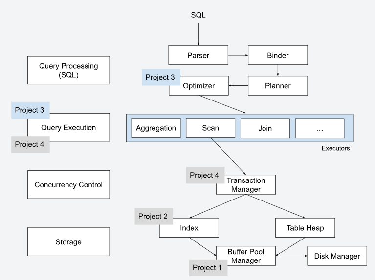

数据库在处理SQL语句时，查询过程会依次经历 **Parser（解析器）**、**Binder（绑定器）**、**Planner（规划器）** 和 **Optimizer（优化器）** 四个核心阶段

**Parser（解析器）：**将输入的SQL语句分解为语法单元，构建抽象语法树（AST）也就是将SQL语句拆解为关键字（如 `SELECT`、`FROM`）、标识符（如表名、列名）、操作符等语法单元

**Binder（绑定器）：**将AST中的标识符（如表名、列名）绑定到数据库中的实际对象（如表、列、索引等），生成语义语法树，比如把 `SELECT *` 展开成具体列、把表名解析成系统目录里的表OID和每列的序号

**Planner（规划器）：**根据语义语法树生成查询计划，描述如何执行查询，将语义语法树转换为逻辑查询计划（Logical Plan），例如将 `SELECT` 转换为投影操作（Projection），将 `WHERE` 转换为选择操作（Selection），将 `JOIN` 转换为连接操作（Join）

**Optimizer（优化器）：**评估不同的查询执行计划，选择成本最低的计划以优化查询性能，在不改变语义的前提下换更快的执行路线，比如把等值内连接从“双重循环”的loop join更换为先建哈希表再探测的Hash join

**火山模型（Volcano Model）**，又称**迭代器模型（Iterator Model）**或**拉取执行模型（Pull-Based Model）**，是数据库查询执行中的一种经典架构，由Goetz Graefe于1994年提出。其核心思想是将SQL查询分解为一系列独立的操作符（Operators），每个操作符负责完成特定的数据处理任务，并通过迭代器接口（`open`、`next`、`close`）实现数据的拉取和传递，形成完整的数据处理流水线。


核心元数据管理区 catalog（目录）

管理表堆、索引等信息

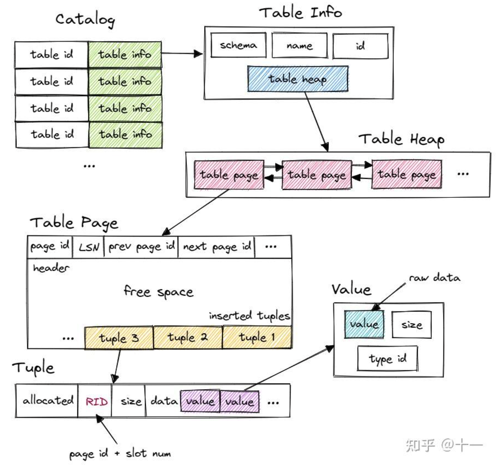

更为详细目录架构：

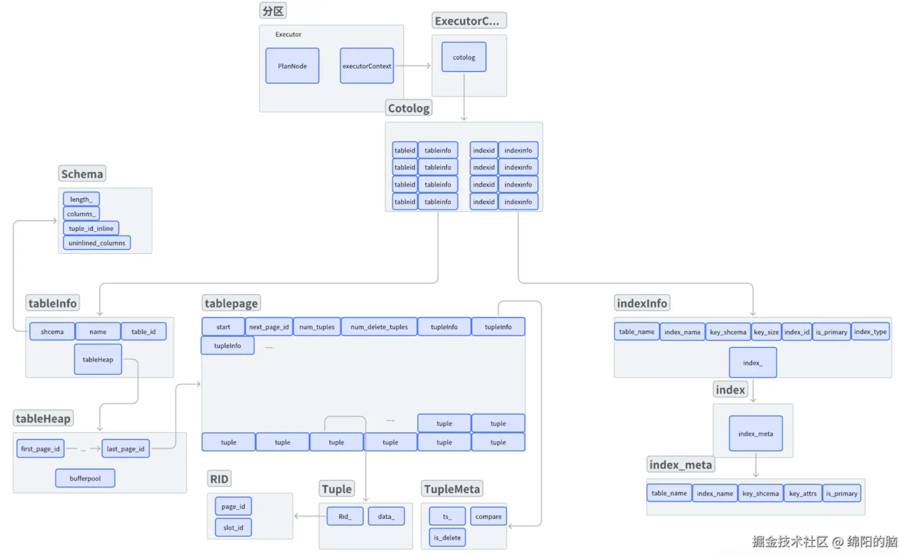

### 2.TASK#1

**重要组件说明**

**1.Catalog：**`Catalog` 类是 数据库系统中的非持久化目录，用于管理数据库中的表和索引元数据，主要功能如下：

**表创建和查找**（通过名称或OID）

**索引创建和查找（**通过名称或OID）

**维护表和索引的元数据信息**

**为新创建的表和索引分配唯一标识符**(OID)

主要的成员和成员函数如下：

```c++
namespace bustub {

// 类型定义
using table_oid_t = uint32_t;  // 表对象ID类型
using column_oid_t = uint32_t; // 列对象ID类型
using index_oid_t = uint32_t;  // 索引对象ID类型

// 索引类型枚举
enum class IndexType { 
    BPlusTreeIndex,      // B+树索引
    HashTableIndex,      // 哈希表索引
    STLOrderedIndex,     // STL有序索引
    STLUnorderedIndex    // STL无序索引
};

// 表元数据结构
struct TableInfo {
    Schema schema_;          // 表模式(结构)
    const std::string name_; // 表名(常量)
    std::unique_ptr<TableHeap> table_; // 表数据堆的独占指针
    const table_oid_t oid_;  // 表唯一对象ID(常量)
};

// 索引元数据结构
struct IndexInfo {
    Schema key_schema_;          // 索引键的模式
    std::string name_;           // 索引名称
    std::unique_ptr<Index> index_; // 索引对象的独占指针
    index_oid_t index_oid_;      // 索引唯一对象ID
    std::string table_name_;     // 所属表名
    const size_t key_size_;      // 键大小(字节)
    bool is_primary_key_;        // 是否是主键索引
    IndexType index_type_;       // 索引类型
};

// Catalog主类
class Catalog {
public:
    // 静态空指针常量，用于表示操作失败
    static inline const std::shared_ptr<TableInfo> NULL_TABLE_INFO{nullptr};
    static inline const std::shared_ptr<IndexInfo> NULL_INDEX_INFO{nullptr};

    // 构造函数，接收缓冲池管理器、锁管理器和日志管理器
    Catalog(BufferPoolManager *bpm, LockManager *lock_manager, LogManager *log_manager)
        : bpm_{bpm}, lock_manager_{lock_manager}, log_manager_{log_manager} {}

    // 创建新表并返回其元数据
    auto CreateTable(Transaction *txn, const std::string &table_name, const Schema &schema, bool create_table_heap = true)
        -> std::shared_ptr<TableInfo>;

    // 通过表名查询表元数据
    auto GetTable(const std::string &table_name) const -> std::shared_ptr<TableInfo>;

    // 通过表OID查询表元数据
    auto GetTable(table_oid_t table_oid) const -> std::shared_ptr<TableInfo>;

    // 创建新索引并返回其元数据
    template <class KeyType, class ValueType, class KeyComparator>
    auto CreateIndex(Transaction *txn, const std::string &index_name, const std::string &table_name, 
                    const Schema &schema, const Schema &key_schema, const std::vector<uint32_t> &key_attrs, 
                    std::size_t keysize, HashFunction<KeyType> hash_function, bool is_primary_key = false,
                    IndexType index_type = IndexType::BPlusTreeIndex) -> std::shared_ptr<IndexInfo>;

    // 通过索引名和表名查询索引元数据
    auto GetIndex(const std::string &index_name, const std::string &table_name) -> std::shared_ptr<IndexInfo>;

    // 通过索引名和表OID查询索引元数据
    auto GetIndex(const std::string &index_name, const table_oid_t table_oid) -> std::shared_ptr<IndexInfo>;

    // 通过索引OID查询索引元数据
    auto GetIndex(index_oid_t index_oid) -> std::shared_ptr<IndexInfo>;

    // 获取指定表的所有索引
    auto GetTableIndexes(const std::string &table_name) const -> std::vector<std::shared_ptr<IndexInfo>>;

    // 获取所有表名
    auto GetTableNames() -> std::vector<std::string>;

private:
    // 系统组件指针
    [[maybe_unused]] BufferPoolManager *bpm_;             // 缓冲池管理器
    [[maybe_unused]] LockManager *lock_manager_;         // 锁管理器
    [[maybe_unused]] LogManager *log_manager_;           // 日志管理器

    // 表元数据存储
    std::unordered_map<table_oid_t, std::shared_ptr<TableInfo>> tables_; // 表OID到表信息的映射
    std::unordered_map<std::string, table_oid_t> table_names_;           // 表名到表OID的映射
    std::atomic<table_oid_t> next_table_oid_{0};                         // 下一个可用的表OID

    // 索引元数据存储
    std::unordered_map<index_oid_t, std::shared_ptr<IndexInfo>> indexes_; // 索引OID到索引信息的映射
    std::unordered_map<std::string, std::unordered_map<std::string, index_oid_t>> index_names_; // 表名到索引名到索引OID的映射
    std::atomic<index_oid_t> next_index_oid_{0};                         // 下一个可用的索引OID
};

} // namespace bustub

// IndexType的格式化输出特化
template <>
struct fmt::formatter<bustub::IndexType> : formatter<string_view> {
    template <typename FormatContext>
    auto format(bustub::IndexType c, FormatContext &ctx) const {
        string_view name;
        switch (c) {
            case bustub::IndexType::BPlusTreeIndex: name = "BPlusTree"; break;
            case bustub::IndexType::HashTableIndex: name = "Hash"; break;
            case bustub::IndexType::STLOrderedIndex: name = "STLOrdered"; break;
            case bustub::IndexType::STLUnorderedIndex: name = "STLUnordered"; break;
            default: name = "Unknown"; break;
        }
        return formatter<string_view>::format(name, ctx);
    }
};
```

**2.ExecutorContext：**本质上是一个系统资源结构模块，管理缓冲池、事物、目录、锁事物，BusTub 执行层的核心基础设施，为具体执行器（如 `UpdateExecutor`）提供运行时所需的数据库组件和配置，主要作用如下：

**解耦执行器与底层组件**执行器只需关注业务逻辑（如过滤、聚合），而事务、锁、缓冲池等由上下文统一管理。

**支持复杂操作（如连接）**通过 `nlj_check_exec_set_` 为连接操作提供运行时验证支持。

**可扩展性**通过 `CheckOptions` 允许动态配置执行行为，适应不同场景（如测试、生产）。

**线程安全基础**结合锁管理器（`lock_mgr_`）和事务管理器（`txn_mgr_`），为并发执行提供支持。

```c++
class ExecutorContext {
 public:
  // 构造函数：初始化执行器上下文，关联事务、目录、缓冲池等组件
  ExecutorContext(Transaction *transaction, Catalog *catalog, BufferPoolManager *bpm, 
                  TransactionManager *txn_mgr, LockManager *lock_mgr, bool is_delete)
      : transaction_(transaction),
        catalog_{catalog},
        bpm_{bpm},
        txn_mgr_(txn_mgr),
        lock_mgr_(lock_mgr),
        is_delete_(is_delete) {
    // 初始化嵌套循环连接（NLJ）的检查执行器集合
    nlj_check_exec_set_ = std::deque<std::pair<AbstractExecutor *, AbstractExecutor *>>(
        std::deque<std::pair<AbstractExecutor *, AbstractExecutor *>>{});
    // 初始化检查选项（默认空）
    check_options_ = std::make_shared<CheckOptions>();
  }

  // 析构函数：默认实现
  ~ExecutorContext() = default;

  // 禁止拷贝和移动构造
  DISALLOW_COPY_AND_MOVE(ExecutorContext);

  // ========== 成员函数 ==========
  
  /** @return 当前运行的事务对象 */
  auto GetTransaction() const -> Transaction * { return transaction_; }

  /** @return 数据库目录对象 */
  auto GetCatalog() -> Catalog * { return catalog_; }

  /** @return 缓冲池管理器 */
  auto GetBufferPoolManager() -> BufferPoolManager * { return bpm_; }

  /** @return 日志管理器（当前未实现，返回nullptr） */
  auto GetLogManager() -> LogManager * { return nullptr; }

  /** @return 锁管理器 */
  auto GetLockManager() -> LockManager * { return lock_mgr_; }

  /** @return 事务管理器 */
  auto GetTransactionManager() -> TransactionManager * { return txn_mgr_; }

  /** @return 嵌套循环连接（NLJ）的检查执行器集合（引用返回，可修改） */
  auto GetNLJCheckExecutorSet() -> std::deque<std::pair<AbstractExecutor *, AbstractExecutor *>> & {
    return nlj_check_exec_set_;
  }

  /** @return 检查选项（共享指针） */
  auto GetCheckOptions() -> std::shared_ptr<CheckOptions> { return check_options_; }

  /** 
   * 添加一对执行器到NLJ检查集合（用于连接操作验证）
   * @param left_exec 左执行器
   * @param right_exec 右执行器
   */
  void AddCheckExecutor(AbstractExecutor *left_exec, AbstractExecutor *right_exec) {
    nlj_check_exec_set_.emplace_back(left_exec, right_exec);
  }

  /** 
   * 初始化检查选项（通过移动语义）
   * @param check_options 新的检查选项（右值引用）
   */
  void InitCheckOptions(std::shared_ptr<CheckOptions> &&check_options) {
    BUSTUB_ASSERT(check_options, "nullptr");
    check_options_ = std::move(check_options);
  }

  /** 
   * @return 是否为删除操作（Fall 2023版本已弃用）
   * @deprecated 
   */
  auto IsDelete() const -> bool { return is_delete_; }

 private:
  // ========== 成员变量 ==========
  
  /** 当前执行器关联的事务对象 */
  Transaction *transaction_;
  
  /** 数据库目录（存储表/索引元数据） */
  Catalog *catalog_;
  
  /** 缓冲池管理器（管理内存与磁盘交互） */
  BufferPoolManager *bpm_;
  
  /** 事务管理器（控制事务生命周期） */
  TransactionManager *txn_mgr_;
  
  /** 锁管理器（实现并发控制） */
  LockManager *lock_mgr_;
  
  /** 
   * 嵌套循环连接（NLJ）的检查执行器集合
   * 存储需要验证的执行器对（如连接操作的左右表扫描）
   */
  std::deque<std::pair<AbstractExecutor *, AbstractExecutor *>> nlj_check_exec_set_;
  
  /** 检查选项（用于执行器内部验证逻辑） */
  std::shared_ptr<CheckOptions> check_options_;
  
  /** 标记是否为删除操作（已弃用） */
  bool is_delete_;
};
```

测试

```shell
#Task1
make -j$(nproc) sqllogictest
# 基础测试
./bin/bustub-sqllogictest ../test/sql/p3.00-primer.slt --verbose
# 顺序扫描测试
./bin/bustub-sqllogictest ../test/sql/p3.01-seqscan.slt --verbose
# 插入测试
./bin/bustub-sqllogictest ../test/sql/p3.02-insert.slt --verbose
# 更新测试
./bin/bustub-sqllogictest ../test/sql/p3.03-update.slt --verbose
# 删除测试
./bin/bustub-sqllogictest ../test/sql/p3.04-delete.slt --verbose
# B+树扫描测试（必须先实现优化器）
./bin/bustub-sqllogictest ../test/sql/p3.05-index-scan-btree.slt --verbose
# 空表测试
./bin/bustub-sqllogictest ../test/sql/p3.06-empty-table.slt --verbose

```


**2.Schema：**用于描述表的元数据（即表的结构） `Schema` 是数据库系统中非常重要的组件，它定义了表的列（`Column`）、数据类型、存储布局等信息，主要功能如下：

**描述表的结构**（列名、数据类型、是否内联等）

**管理列的存储布局**（如内联列的总大小、非内联列的索引）

**提供查询接口**（如按列名查找列索引、获取列信息等）

其中内联指的是数据类型是非变长的，与非内联的存储方式是不同的，本质上**schema**是描述一个表的结构化信息，主要成员有

```c++
private:
  uint32_t length_;                      // 所有内联列的总存储大小（字节）
  std::vector<Column> columns_;          // 所有列（内联 + 非内联）
  bool tuple_is_inlined_{true};          // 是否所有列都是内联的
  std::vector<uint32_t> uninlined_columns_; // 非内联列的索引
```

主要成员函数：

```c++
 explicit Schema(const std::vector<Column> &columns);  // 构造函数：通过列向量创建Schema
  static auto CopySchema(const Schema *from, const std::vector<uint32_t> &attrs) -> Schema;  // 静态方法：复制指定列创建新Schema
  auto GetColumns() const -> const std::vector<Column> &;  // 获取所有列
  auto GetColumn(const uint32_t col_idx) const -> const Column &;  // 通过索引获取列
  auto GetColIdx(const std::string &col_name) const -> uint32_t;  // 通过名称获取列索引（不存在则抛出异常）
  auto TryGetColIdx(const std::string &col_name) const -> std::optional<uint32_t>;  // 尝试通过名称获取列索引（返回optional）
  auto GetUnlinedColumns() const -> const std::vector<uint32_t> &;  // 获取非内联列索引
  auto GetColumnCount() const -> uint32_t;  // 获取总列数
  auto GetUnlinedColumnCount() const -> uint32_t;  // 获取非内联列数
  auto GetInlinedStorageSize() const -> uint32_t;  // 获取元组内联存储大小（字节）
  auto IsInlined() const -> bool;  // 检查是否所有列都是内联的
  auto ToString(bool simplified = true) const -> std::string;  // 生成Schema的字符串表示 主要是打印表列名等
 
```


**3.Value：**


**4.AbstractPlanNode：**


**5.TableInfo：**本质上是表堆元数据，管理表堆等相关信息，比较关键的成员是table_，TableHeap类型是数据页的存放位置，内部主要记录表的元组、元组元数据、列以及当前的游标（迭代器）如果需要对表进行插入或者实际操作，都需要访问这个table成员

```c++
struct TableInfo {
    Schema schema_;          // 表模式(结构)
    const std::string name_; // 表名(常量)
    std::unique_ptr<TableHeap> table_; // 表数据堆的独占指针
    const table_oid_t oid_;  // 表唯一对象ID(常量)
};
```

**TableIterator：**


**Tuple：**


**RID：**


**ScanPlanNode to IndexPlanNode**

最重要的一点是如何判断是否可以转为IndexPlanNode

主要有三条规则：

```
1.当前节点为逻辑表达式 则需要递归去判断左右表达式
# 子节点必须都是比较表达式 且满足如下条件（当前任务要求）
LogicalExpression{LogType == Or, ChildrenExpression[0]
    == CompareExpression && ChildrenExpression[1] == CompareExpression
    && (ChildrenExpression[0 and 1] 符合@1或者符合@2)}
2.当前节点不是逻辑表达式 是合法的比较表达式
# 要么常量值在左 要么常量值在右边
CompareExpression{CmpType == Equal,  ChildrenExpression[0]
    == ColumnExpression && ChildrenExpression[1] == ConstantExpression } 或者
CompareExpression{CmpType == Equal, ChildrenExpression[1]
    == ColumnExpression && ChildrenExpression[0] == ConstantExpression } 或者
3.当前节点上非法的表达式（空或不满足要求）
返回false
```

上述结构可以表示为如下具体例子：

假设一张表有五列

```
id， name， age， gender， tel 
```

查询语句如下

```sql
select * from t1 where age > 18 and id < 10
```

表达式其实就是**age > 18 and id < 10**   Parser和Binder转化后就成了一个过滤谓词  树形结构如下

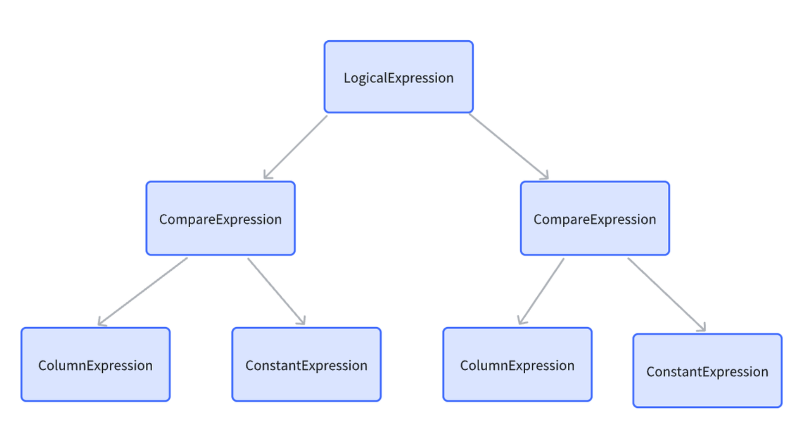

分解步骤：

Layer1——LogiclaExpression：表达式age > 18 and id < 10是一个and逻辑表达式

Layer2——CompareExpression1：age > 18 ； CompareExpression2：id < 10

Layer3——ColumnExpression1：age >  ConstanExpression1：18；ColumnExpression2：id <  ConstanExpression2：10

**ColumnExpression内部有一个col_index， age对应表结构的第三列， 所以这个index就是2， ConstantExpression内部有一个value， value值为18；右侧的CoumnExpression内部的col_index为0， ConstantExpression的value为10**

### 3.TASK#2


测试

```shell
# Task 2
make -j$(nproc) sqllogictest
# 基础聚合测试
./bin/bustub-sqllogictest ../test/sql/p3.07-simple-agg.slt --verbose
# 带group的聚合测试1
./bin/bustub-sqllogictest ../test/sql/p3.08-group-agg-1.slt --verbose
# 带group的聚合测试2
./bin/bustub-sqllogictest ../test/sql/p3.09-group-agg-2.slt --verbose
# 简单连接测试
./bin/bustub-sqllogictest ../test/sql/p3.10-simple-join.slt --verbose
# 多连接测试
./bin/bustub-sqllogictest ../test/sql/p3.11-multi-way-join.slt --verbose
# 重复连接测试
./bin/bustub-sqllogictest ../test/sql/p3.12-repeat-execute.slt --verbose
# 优化索引连接测试
./bin/bustub-sqllogictest ../test/sql/p3.13-nested-index-join.slt --verbose
```


### 4.Task #3 - HashJoin Executor and Optimization

该过程设计的元组键不重复，整个哈希连接主要过程如下：

1.构建哈希表，一般是大的那个表（右表）进行构造，根据右表的键作为哈希键，存储记录其值即可；

2.迭代器模型中左表进行探测，寻找和左表键相等的元组进行匹配；

3.如果没有任何匹配值且为左连接，则输出左元组，否则输出匹配格式的值

这部分首先是需要自定义哈希表，从而支持元组的键值，默认的哈希表是不支持结构体或者自定义类型的哈希值的，需要自己去定义

```c++
// 自定义哈希键
struct HashJoinKey {
  std::vector<bustub::Value> keys_;
  // 防止隐式子转换
  explicit HashJoinKey(std::vector<bustub::Value> keys) : keys_(std::move(keys)) {}
	
  HashJoinKey() = default;
	// 重载等于符号进行冲突认定
  auto operator==(const HashJoinKey &other) const -> bool {
    if (other.keys_.size() != keys_.size()) {
      return false;
    }
    for (size_t i = 0; i < other.keys_.size(); i++) {
      if (keys_[i].CompareEquals(other.keys_[i]) != bustub::CmpBool::CmpTrue) {
        return false;
      }
    }
    return true;
  }
};

// 自定义哈希特化
template <>
struct std::hash<HashJoinKey> {
  auto operator()(const HashJoinKey &key) const -> size_t {
    size_t hash_val = 0;
    for (const auto &val : key.keys_) {
      // 计算当前键的哈希值
      size_t val_hash = bustub::HashUtil::HashValue(&val);
      // 使用异或 + 黄金比例魔法数混合哈希值
      hash_val ^= val_hash + 0x9e3779b9 + (hash_val << 6) + (hash_val >> 2);
    }
    return hash_val;
  }
};

```


测试

```shell
# Task 3
make -j$(nproc) sqllogictest
# 哈希连接测试
./bin/bustub-sqllogictest ../test/sql/p3.14-hash-join.slt --verbose
# 哈希连接对比测试
./bin/bustub-sqllogictest ../test/sql/p3.15-multi-way-hash-join.slt --verbose
```

### 5.TASK#4: External Merge Sort + Limit Executors

**外部合并排序部分External Merge Sort**

主要实现三大模块：

**（1）SortPage**

本质上是一个和数据库页面类似的页面，它主要用于存储排序数据，结构如下所示

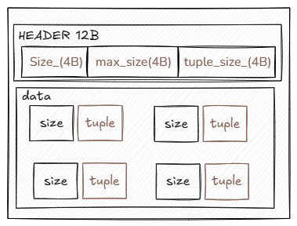

任务的主要目的是尽可能减少成员变量使用和内存碎片

因此需要存储的成员主要有

```c++
// 当前页面存储的所有元组数量
uint32_t size_;
// 当前页面最多能存储的元组大小
uint32_t max_size_;
// 一个元组的大小
uint32_t tuple_size_;
```

其次是整个页面的内存由缓冲池BufferPoolManager管理 包括页面持久化到磁盘也由bpm控制 **整个SortPage只负责一些逻辑操作 由于SortPage是存储Tuple元组的** 因此需要需要一个结构来保存实际的数据 主要布局如下：

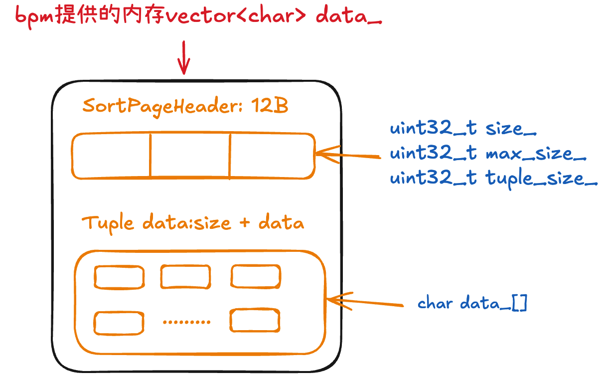

**可以看出实际上管理的Tuple数据是包括其大小数据size和数据data 一般Tuple还有RID信息 但在这个排序的部分由于已经能够获得所有的Tuple 因此是不需要这个数据的RID的 本质是RID就是为了方便用户查找Tuple（这里存疑？）** 

主要的函数如下：

```c++
// 初始化
void Init(uint32_t row_num,uint32_t row_size){
  size_ = 0;
  tuple_size_ = row_num * row_size + META_SIZE;
  max_size_ = (BUSTUB_PAGE_SIZE - SORTPAGE_HEADER_SIZE) / tuple_size_;
};

// 需要反序列化 返回其自带的反序列化方式
auto GetTupleAt(uint32_t pos_idx)->Tuple{
  BUSTUB_ENSURE(pos_idx < size_, "Your idx out of range!\n");
  uint32_t offset = pos_idx * tuple_size_;
  Tuple tuple{};
  tuple.DeserializeFrom(&data_[offset]);
  return tuple;
}

// 需要序列化 使用其自带的序列化方式
auto InsertTuple(const Tuple &tuple)->void{
  uint32_t offset = (size_++) * tuple_size_;
  BUSTUB_ENSURE(offset + tuple_size_ <= BUSTUB_PAGE_SIZE, "Page size is not enough!\n");
  tuple.SerializeTo(&data_[offset]);
}

// 返回当前元组数量
auto GetSize()->uint32_t{  return size_; }

// 判空
auto IsEmpty()->bool{  return size_ == 0; }

// 当前如果满了就需要创建新的页
auto IsFull()->bool{  return size_ == max_size_; }
```

**（2）MergeSortRun**

表示 external merge sort 中的一个 **运行**（Run）即一段已排序的数据集（包含多个`SortPage`数据在块内和块间都是有序的 代表一组已排序的元组 只不过这些被排序后的元组可能分布在多个SortPage中 MergeSortRun负责统筹这一组元组的所有sortPage页 ）比如 当数据太大无法一次性排序时 会先把数据分成 3 块 每块在内存中排好序后写入磁盘 这 3 块就是 3 个运行 后续会逐步合并这些运行 直到得到一个完整的排序结果


**（3）ExternalMergeSortExecutor**

负责协调整个流程，共有三个阶段：**创建初始排序运行->归并排序->迭代**

首先，从子执行器读取多个元组的排序键和元组本身，并存储至 SortEntry，然后使用 std::sort 将这些条目排序，最后将排序后的元组写入排序页面，简单来说就是**将原始数据分成若干小块，每块在内存中排序后存入磁盘**。这里之所以可以调用 std::sort 排序是因为，虽然我们没办法对所有数据一次性内存排序，但可以对单个页面内的数据进行内存排序。

流程如下：

1. 从子执行器（`child_executor_`）读取元组，存入临时列表 `entries`（每个元素包含 “排序键” 和元组本身，方便排序）

2. 当读取的元组数量达到 `max_size * initial_page_cnt`（即当前总页面能容纳的总元组）时，停止读取

3. 对 `entries` 用 `std::sort` 排序（内存中排序）

4. 将排序后的元组写入 SortPage：

   一个页存满后（达到 `max_size`），创建新页继续写；

   所有元组写完后，这些页组成一个 “运行”（一个MergeSortRun包含4个sortPage），加入 `runs_`

5. 重复上述步骤，直至子执行器无更多弹出

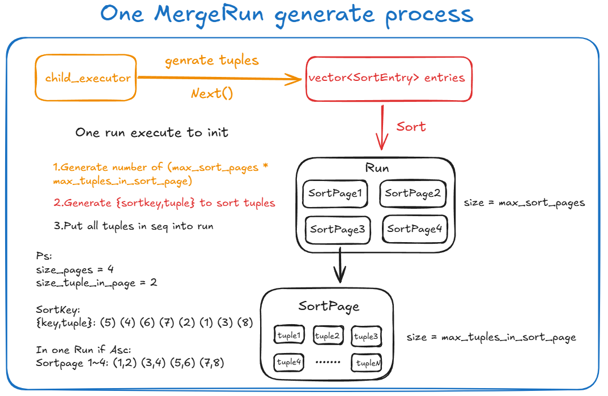


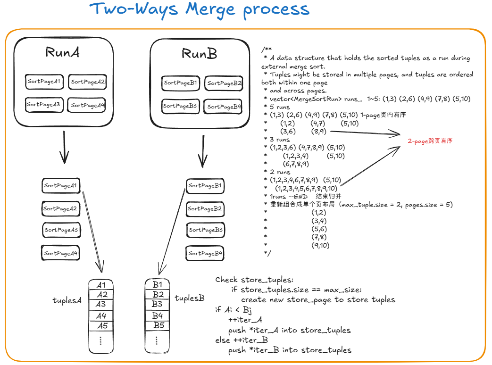

测试

```shell
make -j$(nproc) sqllogictest
# 基础排序和限制测试
./bin/bustub-sqllogictest ../test/sql/p3.16-sort-limit.slt --verbose
# 总体聚合测试
./bin/bustub-sqllogictest ../test/sql/p3.18-integration-1.slt --verbose
./bin/bustub-sqllogictest ../test/sql/p3.19-integration-2.slt --verbose
```


## Project #4 - Concurrency Control

### 背景介绍

本节主要是实现MVCC相关内容 事物的相关框架如下：

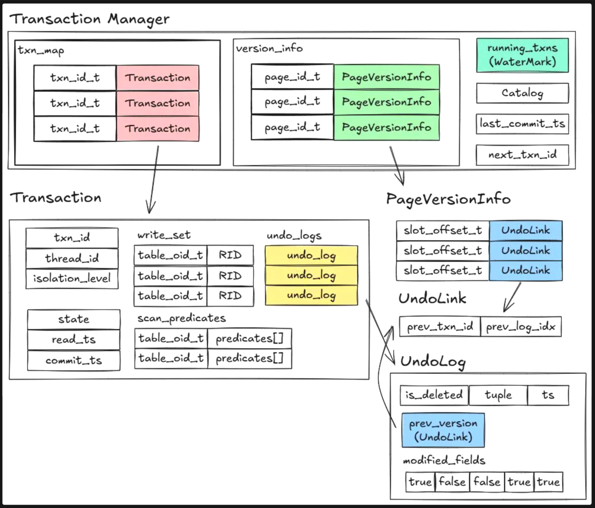

**多版本并发控制（MVCC）** 的典型实现方式，结合了 **版本链（Version Chain）** 和 **Undo Log** 来管理元组的历史版本。这种设计允许事务基于某个时间点的快照进行读取，从而支持 **快照隔离（Snapshot Isolation, SI）**，但无法直接保证 **可串行化（Serializability）**。下面我将详细解释整个过程，并分析为什么它只能支持快照隔离

**1. MVCC + 版本链（Version Chain）的工作原理**

**(1) 元组存储结构**

**表堆（Table Heap）**：存储当前活跃的元组（最新版本）

**Undo Log / Delta 记录**：存储元组的旧版本（增量修改），与最新版本通过指针（版本链）连接

**版本链（Version Chain）**：每个元组有一个单向链表，指向它的历史版本（通过 `prev_ptr` 或类似机制）

**示例**：

```
元组 A (最新版本) → 元组 A_v1 (旧版本) → 元组 A_v0 (最早版本)
```

**(2) 事务的读写操作**

**读操作（Read）：**

事务基于自己的 **读时间戳（Read Timestamp, RT）** 访问版本链

遍历版本链，找到小于或等于当前时间戳的元组版本

**写操作（Write）：**

**插入（Insert）：**直接在表堆中创建新元组，并初始化版本链。

**更新（Update）：**不直接修改原元组，而是创建新版本（`A_new`），并写入表堆，原元组（`A_old`）通过 Undo Log 保留，供其他事务读取旧版本

**删除（Delete）：**标记原元组为“已删除”（设置删除时间戳），但保留在版本链中供读操作回溯。

**(3) 提交（Commit）与回滚（Rollback）**

**提交**：事务的写入对其他事务可见（通过更新全局时间戳或依赖检测）

**回滚**：利用 Undo Log 恢复元组到事务开始前的状态。

**2. 为什么这种设计只能支持快照隔离（SI）？**

快照隔离的核心是 **事务基于某个时间点的快照进行读写，不受其他并发事务的干扰**。MVCC + 版本链的实现天然支持这一点，但无法保证更强的 **可串行化（Serializability）**，原因如下：

**(1) 快照隔离允许写偏斜（Write Skew）**

**写偏斜** 是指两个事务读取不同的数据，然后基于读取的值更新对方读取的数据，导致逻辑冲突。快照隔离无法检测或阻止这种异常。

**例子（银行转账）**：

```sql
-- 事务 T1: 检查账户 A 的余额 >= 100，然后从 B 转 100 到 A
SELECT balance FROM accounts WHERE id = 'A'; -- 看到 A=100
-- 此时 T2 修改了 A 的余额（但 T1 看不到，因为它基于自己的快照）
UPDATE accounts SET balance = balance + 100 WHERE id = 'A';
 
-- 事务 T2: 检查账户 B 的余额 >= 100，然后从 A 转 100 到 B
SELECT balance FROM accounts WHERE id = 'B'; -- 看到 B=100
-- 此时 T1 修改了 B 的余额（但 T2 看不到）
UPDATE accounts SET balance = balance + 100 WHERE id = 'B';
```

在快照隔离下，两个事务可能都成功提交，导致 A 和 B 的总余额减少（违反业务逻辑）。但在可串行化隔离下，至少一个事务应该失败

**(2) 缺少显式的冲突检测**

MVCC + 版本链的设计主要关注 **读写不冲突**（通过多版本），但未显式跟踪事务之间的依赖关系（如 `rw-conflict` 或 `ww-conflict`）因此无法检测 **写偏斜**（需要跟踪事务的读写集）、无法阻止 **只读事务异常**（如只读事务看到部分已提交事务的写入）

**(3) 提交顺序与可见性**

快照隔离的提交顺序可能不满足 **可串行化调度**（即不存在一个串行执行顺序等价于并发执行）。例如：事务 T1 和 T2 的读写操作可能交叉执行，但它们的提交顺序无法映射到任何串行顺序

**快照隔离（Snapshot Isolation, SI）能保证的情况序列化**：

1. **读操作一致性**：快照隔离通过为事务提供数据库在某个时间点的一致性快照，确保事务内的所有读操作都基于同一状态的数据，避免了“不可重复读”问题。例如，在事务执行期间，即使其他事务修改了数据，当前事务仍会看到事务开始时的数据状态。
2. **写操作原子性**：事务的写操作（更新、插入、删除）会反映在快照中，且提交时作为原子操作执行。其他事务要么能看到该事务的所有更新，要么看不到任何更新，保证了写操作的完整性。
3. **避免脏读**：由于事务只能看到已提交的数据，快照隔离天然避免了脏读（读取未提交数据）的问题。

**快照隔离不能保证序列化的情况**：

1. 写偏序（Write Skew）：

   **现象**：两个事务读取重叠状态，修改不相交的对象集后提交，导致业务逻辑约束被违反。

   **示例**：医院值班系统中，两个医生同时检查值班人数（均≥2），然后分别提交请假申请，最终导致无人值班。在快照隔离下，两个事务可能同时看到值班人数为2并提交成功，违反“至少一人值班”的约束。

2. 幻读（Phantom Reads）：

   **现象**：事务执行期间，其他事务插入或删除了符合事务查询条件的数据，导致事务后续操作基于不一致的数据范围。

   **示例**：事务A查询所有库存<5的商品（得到A、B、C），事务B插入商品D（库存=4）。事务A再次查询时可能看到D，导致重复处理。

3. 只读事务异常：

   **现象**：只读事务可能读取到部分提交的数据，导致逻辑错误。

   **示例**：事务A（只读）读取事务B和事务C的数据，事务B已提交而事务C未提交，事务A可能看到事务B的更新但看不到事务C的更新，导致分析结果错误。

4. 非可串行化调度：

   **现象**：事务执行顺序可能导致数据库处于不一致状态，ACID中的“C”（一致性）被破坏。

   **示例**：事务T1将A的值设为B，事务T2将B的值设为A。在快照隔离下，两个事务可能同时看到对方的初始值并提交，导致A和B的值被交换，而串行执行时不会出现此情况。

### 1.Task #1 - Timestamps

该部分主要是实现一个读和提交时间戳以及水位线的相关操作 

#### 1.1 Timestamp Allocation

读取时间戳和提交时间戳由事务管理器维护 每次只允许创建和提交一个事务 那么每个事务的读取时间就是上一个提交事物的时间戳 提交时间就是当前维护的时间戳最大值 + 1这样可以保证每个事务在读取提交的时候都有时间戳控制版本信息 也就是只能读取最新的已经提交的版本 看不到未提交的和未来的事务信息 保障了快照隔离的性质

#### 1.2 Watermark

水位线主要作用是在垃圾回收的时候可以回收那些不需要的垃圾版本（小于活跃事务的时间戳），定义是当前活跃事务的最小读取时间戳 当一个事务被提交或者终止的时候 都会从水位线里面移除这个读取时间戳 因此水位线很显然需要管理所有版本的时间戳信息 并维护一个最小值 用map可以很容易做到删除指定时间戳的事务，并天然的保证了map的第一个值就是水位线，但这里考虑用优先队列实现以减少性能开销

需要修改的文件

[`src/include/concurrency/transaction_manager.h` ](https://github.com/cmu-db/bustub/blob/master/src/include/concurrency/transaction_manager.h)

[`src/concurrency/transaction_manager.cpp` ](https://github.com/cmu-db/bustub/blob/master/src/concurrency/transaction_manager.cpp)

测试：

```shell
# Task 1
make clean
make -j$(nproc) txn_timestamp_test
# 时间戳和水位线测试
./test/txn_timestamp_test 
```

### 2.Task #2 - Storage Format and Sequential Scan

本节主要完成元组重建和元组扫描，这个元组顺序扫描需要支持时间旅行（也就是可以扫描历史版本的元组）


#### 2.1 Tuple Reconstruction

元组重建的必要条件是当前最新元组和日志信息 日志版本链如果为空并且当前元组是被删除的 则无法返回有效元组 因此置为空，否则其余的重建情况都不应该为空

值得注意的是如果在收集重建元组阶段发现收集的结果是nullopt，那么可以直接不用重建，直接返回终元组为nullopt

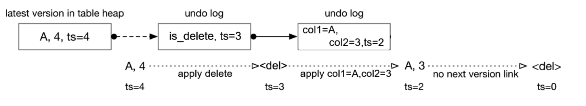


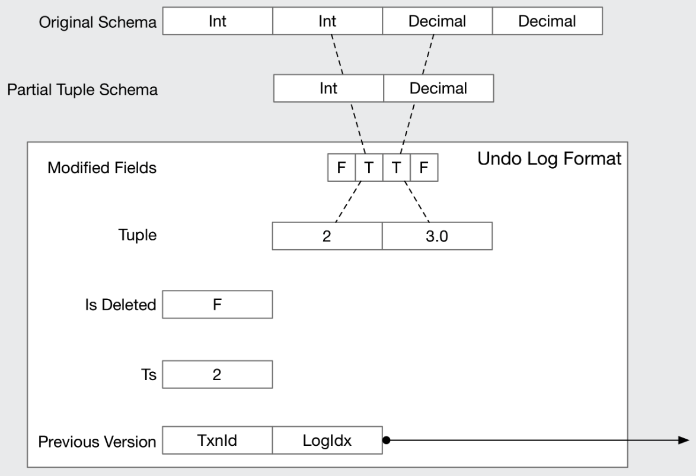

#### 2.2 Sequential Scan (Tuple Retrieval)

根据给定的时间戳去遍历元组 显然如果当前时间戳较小（较旧）那么就需要去通过日志找到第一个小于等于时间戳值的元组，然后去遍历这个元组，这个过程会需要去寻找UndoLog，并根据UndoLog重建元组

给定一个当前事务（包含给定的访问时间戳）和最新的元组信息，如果一个元组处于未提交状态，则元组的时间戳会非常大，本项目是采用的是将未提交的元组时间戳定义为timestamp + (txn_id | 1 << 62) ，假设当前事务处理元组且没提交，则本项目将元组的读取时间戳改为当前事务ID号，如果当前事务修改了元组且没有提交，则这个时间戳非常大，会超出正常的时间戳范围，可以利用这个特点去判断一个元组是否处于未提交状态

分三种情况：

**1.事务访问时间戳大于等于最新的元组时间戳**，显然可以直接使用当前的最新元组tuple，无需利用UndoLog

**2.事务的ID序号等于最新元组的时间戳**，说明是当前事务处理了最新元组，只是没有提交，因此无需UndoLog

**3.事务访问时间小于当前最新元组的时间戳**，需要UndoLog，但其实这里包含两种情况：一种是已提交的事务，另一种是未提交的事务，本项目不需要去判断具体是否是已提交，直接找版本链即可 

测试

```shell
# Task 2
make clean
make -j$(nproc) txn_scan_test
# 扫描测试
./test/txn_scan_test
```


### Task #3 - MVCC Executors

#### 3.1 Insert Executor

主要是执行一个插入新元组的操作 但是是基于事务的角度进行插入 因此需要考虑将这个操作附加一个时间戳 由于是未提交的事务 因此还需要在插入元组的时候 元数据部分设置一下时间戳 = 事务ID从而表示事务进行插入操作的时候是没有提交的

除了上述的更新元组并插入的操作外 还需要将这个插入操作记录进事务管理器的写入集合中 方便管理事务提交

#### 3.2 Commit

这部分就是将前面事务写入集合的所有元组标记的临时时间戳修改为提交时间戳，表示这个事务影响的所有元组都被提交了

#### 3.3 Generate Undo Log

这一部分有许多细节上的东西需要注意


#### 3.4 Update & Delete Executor

这一部分就是改写拍p3的算子，需要基于p3的算子进行添加，需要考虑的情况：

1.就是是否有写写冲突

2.到底什么时候生成Undolog，什么时候生成UndoLink


#### Task 3.5 Stop-the-world Garbage Collection

**Stop-the-world GC 的定义:**

**全局暂停**：**在GC执行期间，系统会暂停所有用户线程（包括事务的读写操作、新事务的创建等），确保内存状态（如undo日志、版本链等）在GC过程中不会被修改**

**目的**：简化GC逻辑（避免并发修改问题），确保GC能安全地识别和回收不可见的数据（如过期的undo日志或版本）

**典型场景**：在数据库系统中，STW GC可能用于清理事务映射表（transaction map）、undo日志或版本链中的无效数据


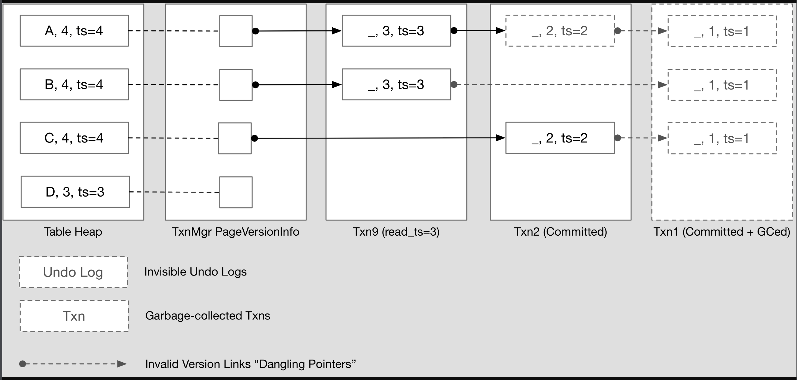

**GC本质上是希望清除那些已经提交的事务中没有Undolog或者Undolog不会被已活跃事务访问的**

测试

```shell
# Task 3
make clean
make -j$(nproc) txn_executor_test
# 扫描测试
./test/txn_executor_test
```


### Task #4 - Primary Key Index

**这部分需要考虑并发的影响，也就是必须假设多个线程会读取写入同一个元组**

#### 4.1 Index Insert

在并发状态下需要考虑的情况主要有：

1.插入时该元组是干净的，即第一次插入，没有生成主键，此时可直接插入，没有任何冲突，因为插入元组以及更新生成并插入主键索引都是在有锁的接口下进行的，无需做额外操作；

2.插入时发现该元组存在主键（可能是之前的事务插入修改了主键索引，也可能是自己当前事务修改了或者其他的事务修改了），那么就需要判断此刻是否会发生冲突，冲突有两部分：1.当前元组是别的事务生成的并且确实存在，说明当前事务触发了主键索引唯一的约束，需要回滚；2.当前元组是处于删除状态的，借助元组的meta部分记录的时间戳可以快速判断冲突情况（因为事务序号ID是原子的，因此元组时间戳的值也是原子的），如果时间戳小于当前事务序号，说明当前事务合法，可以进行操作

3.对删除状态的元组进行插入操作的情况主要分为：1.当前事务删除，当前事务插入，那么无需更新Undolog（可以想象一下，正常的在删除处插入都是因为当前事务包含删除操作，删除操作已经生成了一个全量的Undolog，此时没必要再生成）；2.别的事务删除的，那么需要借助当前事务生成一个崭新的元组undolog记录，链接到元组的操作日志上

**总体来说插入操作考虑的并发很少，大部分都已经自带锁了**


#### 4.2 Index Scan, Delete, & Update

Index Scan和前面的SeqScan一致

Delete也需要满足并发，需要考虑的情况有：

1.删除元组时发现这个元组是当前事务插入的，更新一下旧的Undolog即可（如果有的情况下），即调用UpdateTupleInPlace

2.删除元组时发现这个元组是别的已经完成的事务插入的，那么生成当前的Undolog，为保证线程安全需要调用UpdateTupleAndUndoLink

上面的两个接口都需要check函数，本质上check函数需要做的就是test and set，拿到一个页面的写锁，先检查待写入内容是否符合预期，如果符合就写入，否则不进行操作

```c++
// check  
if(base_ts != o_meta.ts_){
      return false;
  }
  return o_meta.ts_ <= txn->GetReadTs() || o_meta.ts_ == txn->GetTransactionTempTs();
```


最主要的是Update，Update操作主要流程是需要更新某个元组，需要考虑主键索引的情况，一般来讲只需要原地更新即可，但由于主键索引也需要更新且不能违反唯一约束（例如一个事务中需要更新所有主键索引所在的列，而更新的方式为指定列 + 1，那么按照顺序从第一个元组往下依次更新的时候会发现如果第二个元组的主键索引值恰好为第一个元组的值 + 1，则第一个元组更新的时候会发生主键索引冲突，但这是不应该存在的），所以我们不得不把需要更新的索引放在一块，把事务中所涉及到的所有元组索引删除完成后才能更新索引，因此最简单的办法就是利用现成的满足并发的Insert和Delete接口，把事务中的更新操作分解为Delete和Insert，先删除再插入，插入接口已经论证过了，是一个满足并发的接口，而删除本质上是更新元组的元数据而已，同时再更新其Undolog


```shell
# Task 4
make clean
make -j$(nproc) txn_index_concurrent_test
./test/txn_index_concurrent_test

make clean
make -j$(nproc) txn_index_test
./test/txn_index_test
```

