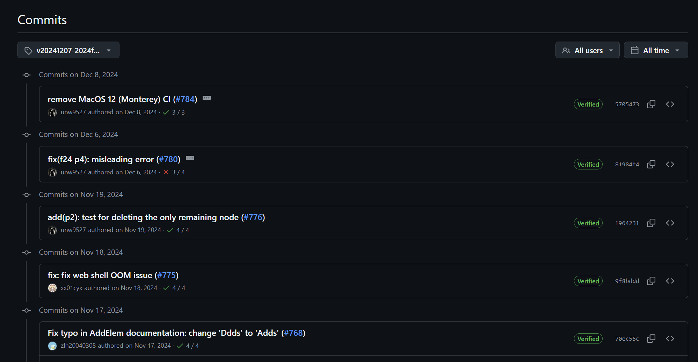
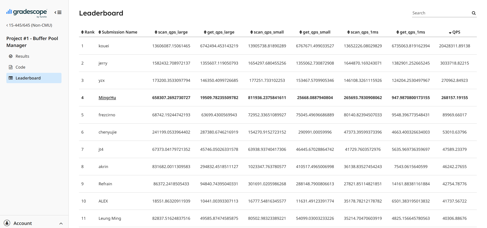
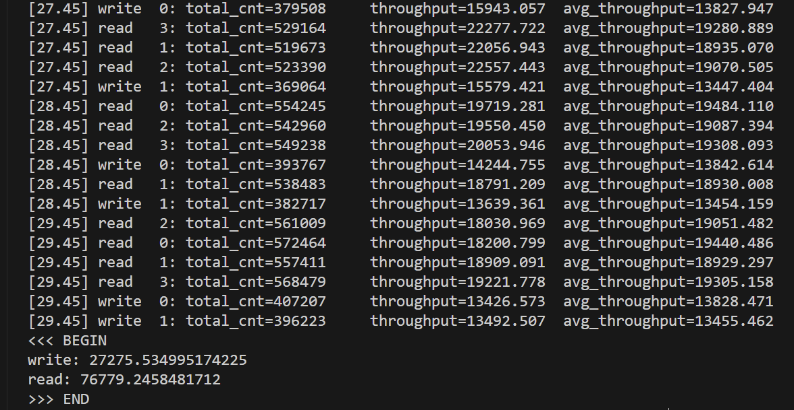
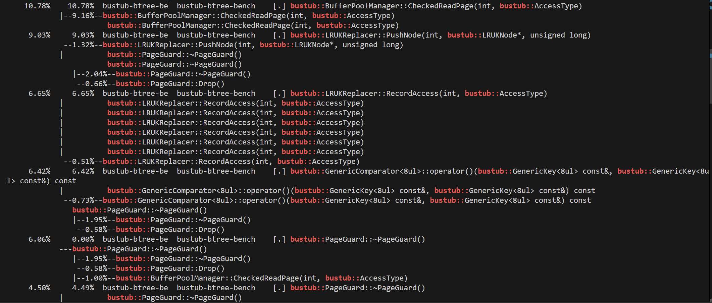
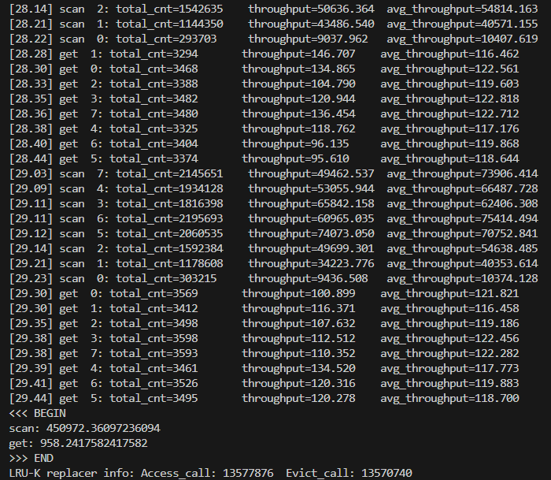
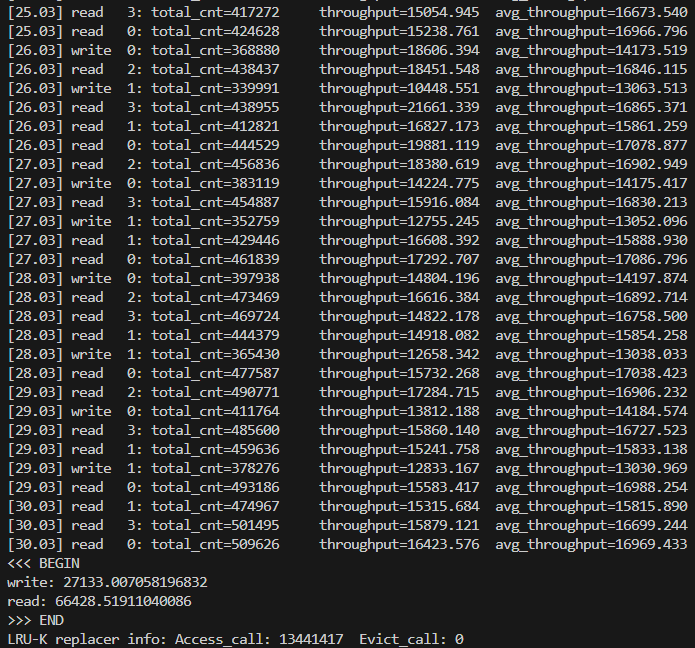
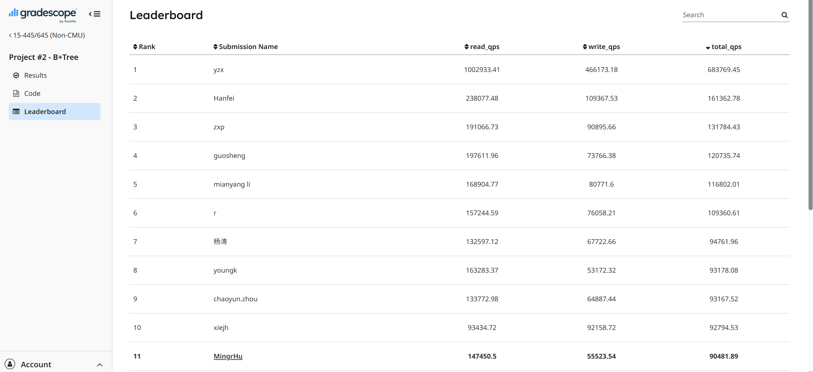

# CMU-15445 2024Fall

## 环境搭建和项目准备

### 1.软件和环境配置

项目的编译测试等都需要运行在linux下面，因此在windows上采取的方案为**Windows 上的安装VS Code** ，**远程remote wsl连接Ubuntu22.04的文件系统**，**实际编译和执行都在 WSL 的Ubuntu22.04环境中进行**，苹果Macos也类似

**（1）所需要的软件：**

**git + VSCode + LLVM全家桶 + cmake**

其中LLVM和cmake是安装在Unbuntu上的：

`clang`：**更人性化的编译器**

`clangd`：**类似于IntelliSense 但更智能**

`lldb`：**调试工具（LLVM 生态的 GDB 替代品）**

`cmake`：**构建项目（同时生成 compile_commands.json 的关键clangd`需要）**

```shell
sudo apt install clang clangd lldb cmake
```

**（2）安装VSCode上的插件 需要安装的有：**

**cmake和camketools、clanged、CodeLLDB依次安装即可**，这部分插件是需要通过**远程连接到Ubuntu22.04**后在上面进行远程安装的

**（3）安装LLVM 17回到ubuntu里面，我们需要运行如下命令：**

```shell
wget https://mirrors.tuna.tsinghua.edu.cn/llvm-apt/llvm.sh
chmod +x llvm.sh
sudo ./llvm.sh all -m https://mirrors.tuna.tsinghua.edu.cn/llvm-apt
```

**（4）克隆busthub项目到本地PC**

先进行克隆仓库操作，克隆项目就是 **获取官方课程代码模板**，然后在此基础上实现你的部分代码。没有这个仓库，就无法完成 15-445 的 Lab 和 Project，因为测试用例、框架、CMake 配置、工具链全都在里面，主要步骤如下：

① 在自己的github上创建一个bustub-private的仓库

② 在本地添把公共库的历史记录裸克隆到本地 这个克隆只包含提交历史记录 没有任何工作文件

```shell
git clone --bare https://github.com/cmu-db/bustub.git bustub-public
```

③ 把刚刚克隆的公共库推送到远程bustub-privete 前三步主要是为了避免从本地克隆整个公共库又把整个库推送到远程 会比较浪费时间 只需要从公共库推送到私人库即可

```shell
cd bustub-public
# If you pull / push over HTTPS
git push https://github.com/student/bustub-private.git master
# If you pull / push over SSH
git push git@github.com:student/bustub-private.git master
# 如果选用ssh方式需要按照流程配置密匙
```

④ 删除本地的公共克隆 并把远程的私有库克隆到本地

```shell
cd ..
rm -rf bustub-public
mkdir cmu-15445 && cd cmu-15445
# If you pull / push over HTTPS
git clone https://github.com/MingrHu/bustub-private.git
# If you pull / push over SSH
git clone git@github.com:MingrHu/bustub-private.git
```

⑤ 如果是做的之前的项目 例如2024Fall则需要从历史记录里面拉取之前的2024Fall版本的仓库快照，可从公共库里面的提交标签去拉取2024Fall版本的仓库



拉取标签处的提交，直接更新为当前2024Fall的版本，提交后同步到私人库

```shell
# 覆盖工作目录中的文件，不移动 HEAD 指针
git checkout 570547381a71e6494cc02ee457f3163bdf004eb6 -- .
```

否则如果是最新的项目，无需上面的步骤

⑥ 将公共的 BusTub 仓库添加为第二个远程仓库

```shell
git remote add public https://github.com/cmu-db/bustub.git
```

查看是否添加成功

```shell
# 输出
# colin@RogDemon-7P:~/cmu-15445/bustub-private$ 
git remote -v
origin  git@github.com:MingrHu/bustub-private.git (fetch)
origin  git@github.com:MingrHu/bustub-private.git (push)
public  https://github.com/cmu-db/bustub.git (fetch)
public  https://github.com/cmu-db/bustub.git (push)
```

上述的具体流程参考[https://github.com/cmu-db/bustub](https://github.com/cmu-db/bustub?tab=readme-ov-file)里面的READEME，目前基本前置环境配置完成，需要注意的是，在wsl上采用http克隆可能会有网络问题，因此简要介绍ssh克隆的流程

```shell
# 创建ssh密匙
ssh-keygen -t ed25519 -C "your_email@example.com"
# 查看密匙
ls -al ~/.ssh
# 启动代理并且添加私匙 
colin@RogDemon-7P:~$ eval "$(ssh-agent -s)"
Agent pid 8472
colin@RogDemon-7P:~$ ssh-add ~/.ssh/id_ed25519
Identity added: /home/colin/.ssh/id_ed25519 (1696994159@qq.com)
# 获取公匙内容 从而添加到github的sshkey里面
cat ~/.ssh/id_ed25519.pub
# 检测是否能和远程GitHub仓库建立ssh连接 
colin@RogDemon-7P:~$ ssh -T git@github.com
The authenticity of host 'github.com (20.205.243.166)' can't be established.
ED25519 key fingerprint is SHA256:+DiY3wvvV6TuJJhbpZisF/zLDA0zPMSvHdkr4UvCOqU.
This key is not known by any other names
Are you sure you want to continue connecting (yes/no/[fingerprint])? yes
Warning: Permanently added 'github.com' (ED25519) to the list of known hosts.
Hi MingrHu! You've successfully authenticated, but GitHub does not provide shell access.
```

然后执行ssh克隆

```shell
git clone --bare git@github.com:cmu-db/bustub.git bustub-public
```

在自己的GitHub上创建私人仓库 并将当前目录下的公共框架仓库推送过去

```shell
git push git@github.com:MingrHu/bustub-private.git master
```

**剩下的部分参考bustub和前面的内容**

### 2.编译项目

这部分内容也请参考https://github.com/cmu-db/bustub?tab=readme-ov-file

```shell
# Linux
sudo build_support/packages.sh
# macOS
build_support/packages.sh
```

编译构建

```shell
mkdir build
cd build
cmake ..
make
```

如果在构建项目的时候提示没有用clang：

```shell
sudo update-alternatives --install /usr/bin/clang clang /usr/bin/clang-14 100
sudo update-alternatives --install /usr/bin/clang++ clang++ /usr/bin/clang++-14 100
# 重新build
cd ~/cmu-15445/bustub-private
rm -rf build    # 删除旧的 build 目录
mkdir build     # 新建 build 目录
cd build
# cmake主要是根据项目的makefilelists构建makefile
[CMakeLists.txt] --(cmake)--> [Makefile] --(make)--> [binary output]
mkdir build
cd build
cmake ..       # 生成 Makefile
make           # 编译程序
# 如果macos提醒cmake版本问题直接强制降级忽略即可
cmake .. -DCMAKE_POLICY_VERSION_MINIMUM=3.5
```

如果需要切换编译选项为Debug模式，直接传入cmakelists就行

```shell
cmake -DCMAKE_BUILD_TYPE=Debug ..
make -j`nproc`
```

整个项目结构：

```
drwxr-xr-x 11 colin colin  4096 Jul 22 22:39 ./
drwxr-xr-x  3 colin colin  4096 Jul 22 21:27 ../
-rw-r--r--  1 colin colin   241 Jul 22 21:37 .clang-format
-rw-r--r--  1 colin colin  5128 Jul 22 21:37 .clang-tidy
-rw-r--r--  1 colin colin    44 Jul 22 21:37 .dockerignore
drwxr-xr-x  8 colin colin  4096 Jul 22 21:37 .git/
-rw-r--r--  1 colin colin    18 Jul 22 21:37 .gitattributes
drwxr-xr-x  3 colin colin  4096 Jul 22 21:37 .github/
-rw-r--r--  1 colin colin  4360 Jul 22 21:37 .gitignore
-rw-r--r--  1 colin colin 16813 Jul 22 22:32 CMakeLists.txt
-rw-r--r--  1 colin colin  1185 Jul 22 21:37 GRADESCOPE.md.template
-rw-r--r--  1 colin colin  1075 Jul 22 21:37 LICENSE
-rw-r--r--  1 colin colin  5959 Jul 22 21:37 README.md
drwxr-xr-x  9 colin colin  4096 Jul 22 22:52 build/
drwxr-xr-x  3 colin colin  4096 Jul 22 21:37 build_support/
-rwxr-xr-x  1 colin colin  3546 Jul 22 21:37 gradescope_sign.py*
drwxr-xr-x  2 colin colin  4096 Jul 22 21:37 logo/
drwxr-xr-x 16 colin colin  4096 Jul 22 21:37 src/
drwxr-xr-x 16 colin colin  4096 Jul 22 21:37 test/
drwxr-xr-x 13 colin colin  4096 Jul 22 21:37 third_party/
drwxr-xr-x 12 colin colin  4096 Jul 22 21:37 tools/
```

**其中build项目里面执行make操作，CMakeLists.txt已经默认写好，我们需要完成的就是src里面的的代码，并执行test进行测试**

## Project #0 - C++ Primer

### TASK#1


### TASK#2


### 最终提交操作

该模块编译至格式修正以及提交的方式如下：

```shell
# 普通执行编译和测试
cd ~/cmu-15445/bustub-private/build
make clean  # 清理旧编译
make -j$(nproc) hyperloglog_test  # 重新编译

# 如果需要进行gdb调试
cmake -DCMAKE_BUILD_TYPE=Debug ..  # 确保 Debug 模式
gdb ./test/hyperloglog_test
break hyperloglog_test.cpp:49 # 文件指定处断点
print /t val # 打印二进制值

# 测试通过后格式修正和提交
# 主要是通过根目录下定义的clang-format来检查修正代码格式
make format
make check-clang-tidy-p0
# 在根目录CMakeLists.txt 中修改“set(P0_FILES)”为：
set(P0_FILES
        "src/include/primer/hyperloglog.h"
        "src/include/primer/hyperloglog_presto.h"
        "src/primer/hyperloglog.cpp"
        "src/primer/hyperloglog_presto.cpp"
)
# 执行下面命令前请先检查是否有zip工具 没有就安装
make submit-p0
```

其余项目提交方式

```bash
# build目录下
make format
make check-clang-tidy-p1/2/3/4...
make submit-p1/2/3/4...
cd ..
# 需要签名
python3 gradescope_sign.py
```


## Project #1 - Buffer Pool Manager

### 关键设计：

PageGuard锁的设计方案：

目前有两个锁：

bpm的缓冲池大锁和rwlatch的帧读写锁，对于帧，我们还需要对其元数据：pincount、isvalid、evictble进行修改，


benchmark调试和发布配置方式

```shell
# release
mkdir cmake-build-relwithdebinfo
cd cmake-build-relwithdebinfo
cmake .. -DCMAKE_BUILD_TYPE=RelWithDebInfo
meake clean
make -j `nproc` bpm-bench
./bin/bustub-bpm-bench --duration 5000 --latency 1

# 创建并进入 Debug 构建目录
# 使用 Debug 配置生成构建系统
# 编译 bpm-bench 目标（使用所有可用CPU核心）
mkdir -p cmake-build-debug
cd cmake-build-debug
cmake .. -DCMAKE_BUILD_TYPE=Debug
make -j `nproc` bpm-bench 
./bin/bustub-bpm-bench --duration 5000 --latency 1
```





## Project #2 - B+Tree


调试和测试

```shell
# 1 B+树插入测试
cd build
make clean
make b_plus_tree_insert_test -j `nproc`
./test/b_plus_tree_insert_test

# 2 B+树顺序测试
cd build 
make clean
make b_plus_tree_sequential_scale_test -j `nproc`
./test/b_plus_tree_sequential_scale_test

# 3 B+树删除测试
cd build
make clean
make b_plus_tree_delete_test -j `nproc`
./test/b_plus_tree_delete_test

# 4 B+树并发测试
cd build
make clean
make b_plus_tree_concurrent_test -j `nproc`
./test/b_plus_tree_concurrent_test

# 5 串行并行对比测试
# 正常范围在[2.5,3.5] 过高说明多线程竞争太激烈 过低说明锁设计不合理接近全局锁
cd build 
make clean
make b_plus_tree_contention_test -j `nproc`
./test/b_plus_tree_contention_test

```

压力测试

```shell
# release
mkdir cmake-build-relwithdebinfo
cd cmake-build-relwithdebinfo
cmake .. -DCMAKE_BUILD_TYPE=RelWithDebInfo
make clean
make -j `nproc` btree-bench
./bin/bustub-btree-bench
```

压力测试优化



目前的写入QPS较低，只有不到3W，开始寻找原因，这里我们使用perf工具

```shell
# 采集数据
perf record -g -o btree-bench.data ./bin/bustub-btree-bench
# 输出调用火焰图结果
perf script -i btree-bench.data > btree-bench.txt
# 输出函数耗时结果
perf report -i btree-bench.data | grep 'bustub::'
```

发现其实主要的性能瓶颈在buffer_pool，因为本质上B+树的高度较低，所以分裂和插入的主要耗时操作在于buffer_pool的页面置换以及大锁上面



页面置换非常耗时，主要在于LRU-K替换费时，然后给出的主要耗时部分在访问记录阶段，先去看看buffer_pool的压力测试对LRU-K替换器的调用情况：

首先是内存池的压力测试，本次压力测试启动参数如下：

```shell
# release
mkdir -p cmake-build-relwithdebinfo
cd cmake-build-relwithdebinfo
make clean
make -j `nproc` bpm-bench
./bin/bustub-bpm-bench --duration 30000 --latency 1

# debug
mkdir -p cmake-build-debug
cd cmake-build-debug
make clean
make -j `nproc` bpm-bench 
./bin/bustub-bpm-bench --duration 5000 --latency 1
```

**发现在缓冲池的压力测试中，淘汰和访问记录的调用次数相当**



**其次再对B+树进行压力测试**

```shell
cd cmake-build-relwithdebinfo
cmake .. -DCMAKE_BUILD_TYPE=RelWithDebInfo
make clean
make -j `nproc` btree-bench
./bin/bustub-btree-bench
```

从这里可以看出缓冲池的帧数量很足够，因此不需要淘汰页面，那么我们先去考虑如何优化LRU-K的记录访问




优化后的结果



## Project #3 - Query Execution


## Project #4 - Concurrency Control

