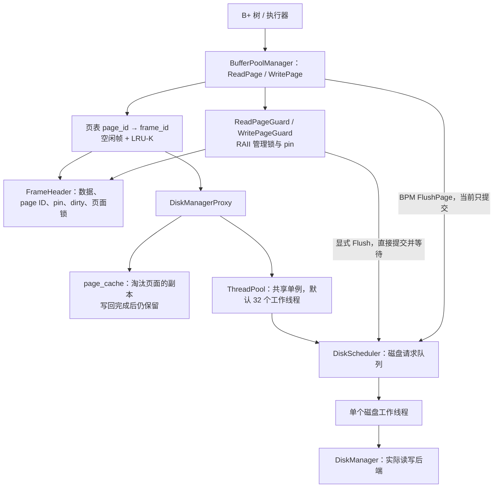
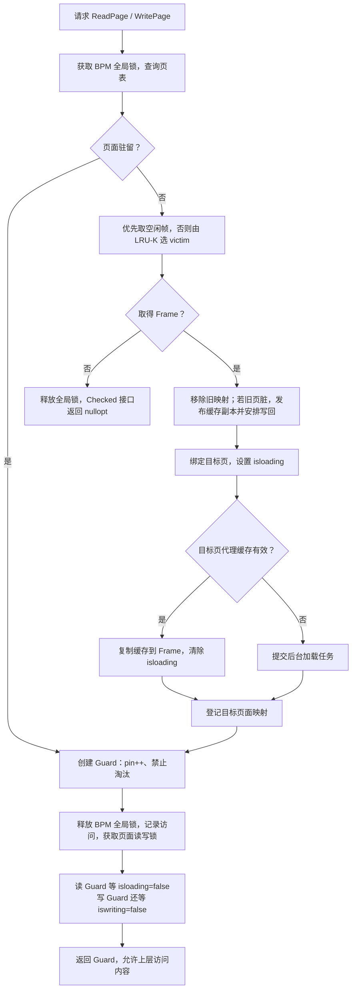
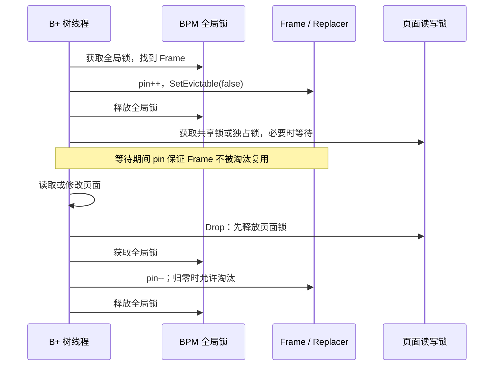
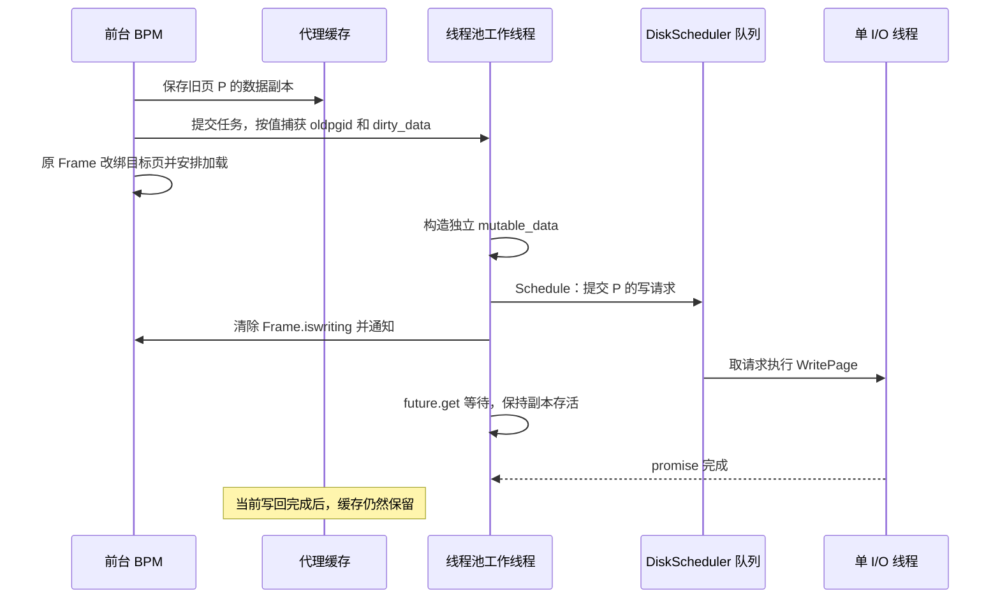

# 缓冲池优化

本文记录当前实现的架构、性能设计和正确性边界。基于提交 `535a699` 及本次提交的调整：将 `iswriting_` 清零移至 `Schedule()` 之后。文中区分“当前行为”“设计收益”和“待验证方案”，不将异步提交等同于写盘完成。

## 1. 总体分层

当前结构是主缓冲池、代理页面缓存、后台任务池和串行磁盘调度器。分层职责有价值，但整体正确性仍依赖跨层的页面版本、请求顺序和生命周期协议，不能仅凭组件划分认定实现完全正确。



代码入口：

- [BufferPoolManager 与 ThreadPool 声明](/Users/hmr/Desktop/bustub-private/src/include/buffer/buffer_pool_manager.h)
- [页面访问与磁盘代理](/Users/hmr/Desktop/bustub-private/src/buffer/buffer_pool_manager.cpp)
- [PageGuard](/Users/hmr/Desktop/bustub-private/src/storage/page/page_guard.cpp)
- [DiskScheduler](/Users/hmr/Desktop/bustub-private/src/storage/disk/disk_scheduler.cpp)

`NewPage()` 分配页面 ID 并通知后端扩容，不立即占用 Frame。页面首次访问时才绑定内存帧。

## 2. 获取页面：主缓存、代理缓存、磁盘三级路径



后台加载任务经 DiskScheduler 读取数据，等待 `future.get()`，然后在 `io_latch_` 保护下清除 `isloading_` 并通知条件变量。等待者释放 I/O 状态互斥锁睡眠，不会忙轮询。

当前 `AccessType::Scan/Lookup` 虽然进入 BPM 接口，但没有传递给 Guard 内的访问记录，Replacer 也没有利用它优化策略。

## 3. PageGuard：锁与占用状态的交接



亮点在于分开保护两种不变量：

- pin 与 evictable 状态保护页面驻留关系，且在全局锁内与淘汰、删除协调。
- 页面读写锁保护内容访问；等待它之前释放全局锁，避免单页竞争阻塞其他页面，也避免形成全局锁等待页面锁的依赖。

Guard 自动清理提前返回、正常返回和异常栈展开路径上的资源。移动后源 Guard 失效，避免重复解锁和重复 unpin。B+ 树仍须选择正确的多页加锁顺序及释放时机，RAII 不代替树算法的并发协议。

## 4. 脏页写回：前台与后台分离



这里有三个不同的时刻：

| 时刻 | 说明 |
| --- | --- |
| 副本准备好 | 后台不必再借用原 Frame 的内容 |
| Schedule 返回 | 当前请求已经进入磁盘请求队列 |
| future.get 返回 | 该请求的 DiskManager 操作已返回 |

当前代码在 `Schedule()` 返回后清除 `iswriting_`，保证本任务先入队再清零，但不代表写盘已经完成，也不是跨 Frame 的同页顺序屏障。即使等待 future，也只说明后端操作完成；断电持久性取决于具体后端是否提供相应保证。

性能设计的价值是保存旧 page ID 和独立字节副本：Frame 改绑新页面后，后台仍能将正确的旧数据写向旧页面，允许 Frame 复用与写盘重叠。代理缓存还让被淘汰页面再次访问时绕过磁盘。

## 5. 将 iswriting 清零移动到 Schedule 后：有效但不足以单独修复顺序

本次提交包含的局部调整是：

```cpp
disk_scheduler_->Schedule(std::move(r));
{
  std::unique_lock lock(frame->io_latch_);
  frame->iswriting_ = false;
  frame->frame_cv_.notify_all();
}
ft.get();
```

这会建立“本任务请求已入队 → 本任务清除标记”的程序顺序。若下一次同页写回确实必须等这个标记，且没有其他路径绕开，那么串行调度器能利用这个顺序。

但当前标记属于 **Frame**，写回顺序应属于 **page ID**。页面可以从 F1 淘汰后，在 F2 中重新加载、修改。F2 的写入并不等待 F1 的标记。

### 5.1 跨 Frame 的反例

```cpp
// 单个前台线程，严格依次执行：

{ auto g = bpm.WritePage(P); /* 把 P 写成 v1 */ }

// 假设这次访问淘汰 F1 中的 P：
// 缓存保存 v1，提交后台任务 W1，然后 F1 加载 Q。
{ auto g = bpm.ReadPage(Q); }

// 假设 P 这次装入 F2。
// 从代理缓存读到 v1，然后明确地修改为 v2。
{ auto g = bpm.WritePage(P); /* 把 P 写成 v2 */ }

// 假设这次访问淘汰 F2 中的 P，提交后台任务 W2。
{ auto g = bpm.ReadPage(R); }
```

这是条件化的执行序列推演，尚非确定性复现测试：假设替换器选择上述 Frame，F2 没有未完成的旧写标记，且 W1 在真正调用 `Schedule()` 前暂停，其他工作线程仍可推进加载与 W2。读取 Q 仅等待加载完成；在 F2 中写 P 等待的是 F2 的标记，而非 F1 的标记。因此 W2 可能先入磁盘队列，W1 后入队，串行磁盘线程便会先写 v2 再写 v1。此时代理缓存仍可能保存 v2，磁盘却最终保存 v1。这里的 v1、v2 修改在前台严格有序，不依赖上层并发写入。

线程池按 FIFO 取任务，并不保证任务里的 `Schedule()` 也按相同顺序执行：先取出的任务可以被抢占，后取出的任务可以先提交。

### 5.2 保留当前架构时需要补齐的协议

- 可以把标记移到 Schedule 后，但这只是局部增强；不要将其当作完整顺序修复。
- 按 page ID 分配写回序号，在产生版本并发布缓存的同一受保护过程里登记顺序；入磁盘队列时必须兑现该顺序。
- 仅在后台 Schedule 前加一把 page mutex 仍不足够，因为 W2 仍可能先拿到锁。需要序号门控或每页 FIFO 调度。
- 若用每页 FIFO，尽量只让每页队头任务可运行，避免大量后继任务占住线程等待前驱、耗尽工作线程。
- 直接 Flush 也必须进入同页顺序协议，不能绕开代理后覆盖更新版本。
- 缓存保存最新版本；旧任务的完成不能清除或覆盖新缓存。驻留页修改后，缓存可以先失效，淘汰时再发布最新快照。
- 明确旧 Frame 标记的代际归属，避免旧任务修改已经复用的 Frame 状态。

上述完整顺序协议仍是待实现建议；本次代码仅调整了 `iswriting_` 清零与 `Schedule()` 的先后顺序。

## 6. 线程池带来的性能点：作用与证据分别说明

| 机制 | 当前具体作用 | 可以期待的收益 | 边界 |
| --- | --- | --- | --- |
| 工作线程复用 | 任务从队列交给固定工作线程 | 避免每次 I/O 新建线程 | 对比对象是每请求创建线程，不代表一定优于直接异步入队 |
| 后台持有写副本 | 局部数据在 future 等待期间保持存活 | Frame 无需一直保存旧页数据 | 所有权封装也能完成此职责 |
| 后台等待与通知 | 工作线程等待完成，再通知页面加载者 | 将加载完成管理与 BPM 元数据操作分离 | 缺页调用本身仍需等待数据就绪 |
| 短任务队列临界区 | 取出任务后释放队列锁再执行 | 队列锁不覆盖磁盘等待 | 每页顺序不由该 FIFO 自动保证 |
| 条件变量 | 空闲工作线程及加载等待者睡眠 | 减少忙等待的 CPU 消耗 | 不是额外的磁盘并行能力 |

底层只有一个 I/O 线程，所以代理工作线程大多在等待同一个调度器。线程池可组织多个任务并使前后台重叠，但不能直接突破后端串行吞吐上限。32 个工作线程会间接限制推进中的任务数量；任务队列本身仍可能增长，不是有界内存背压。

当前高扫描吞吐的重要来源是**长期保留的代理缓存**。缓存命中走前台内存复制，甚至不需要进入线程池。不能把这个收益全部归因于线程池。

### 6.1 已有测量及其限制

本会话之前的 RelWithDebInfo 测试参数为：30 秒、latency=1、6400 页、64 帧、K=16、8 scan + 8 get。后端为内存磁盘加模拟延迟；get 是随机读取并修改页面。

| 实现 | scan 次/秒 | get 次/秒 | 退出情况 |
| --- | ---: | ---: | --- |
| 原缓存与线程池方案，第二轮 | 597325.30 | 859.37 | 打印汇总后信号 11 退出 |
| 已撤回的移除线程池实验 | 267.09 | 289.10 | 正常退出 |

原方案第一轮也以段错误退出，未留下最终汇总。退出原因没有通过调试器确认。

撤回实验同时取消永久缓存、增加队列背压并改变 Flush 行为，不能用于计算“线程池提升了多少倍”。它说明组合方案退化，不能隔离各因素贡献。

6400 页按每页 4096 字节计算约 25 MiB，而主池 64 帧约 256 KiB。代理缓存没有容量淘汰，可能保存远超主池的页面数据。性能报告应写清这部分内存，而不是把系统描述为只有 64 帧的总缓存。

后续要评价线程池净收益，应固定缓存策略、内存预算、磁盘线程数、Flush 语义和负载，仅改变任务执行方式，分别记录 scan/get、缓存命中率、写回数、任务积压、CPU、退出及排空时间。正确性检查通过且正常退出后，才适合形成稳定性能结论。

## 7. 优化亮点的表述

可以据实介绍：

1. 基于 RAII 和移动语义封装 PageGuard，统一页面锁与 pin/unpin，减少异常和提前返回路径的资源泄漏。
2. 在全局锁内固定 Frame，释放全局锁后等待页面锁，缩短全局临界区并降低跨页面阻塞。
3. 采用 LRU-K 管理可淘汰帧，结合 pin 状态避免淘汰使用中的页面。
4. 引入代理页面缓存，使已淘汰页面能够从内存副本重新加载，减少后端读取。
5. 使用独立脏页副本和后台任务组织异步写回，支持 Frame 复用与后台 I/O 重叠。
6. 通过 promise/future 和条件变量组织完成通知，避免忙轮询。

当前不应宣称已经实现：严格同页写回顺序、稳定的断电持久性、32 路磁盘并行，或经单变量实验证明的线程池吞吐提升。现有退出生命周期、缓存与 Flush 一致性、按页顺序和共享容器同步仍需要验证完善。
